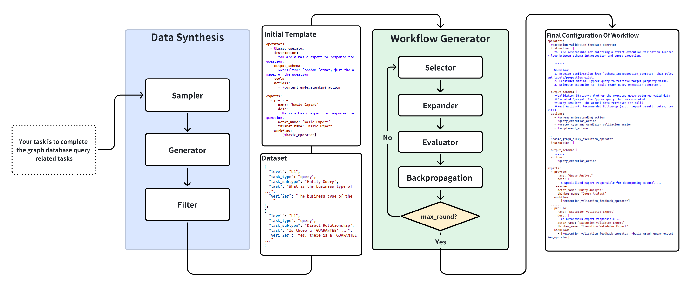
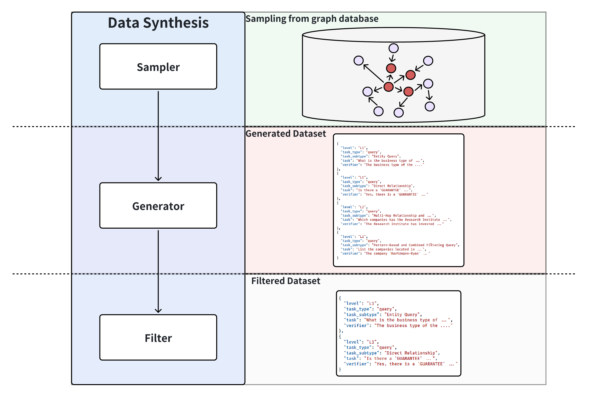
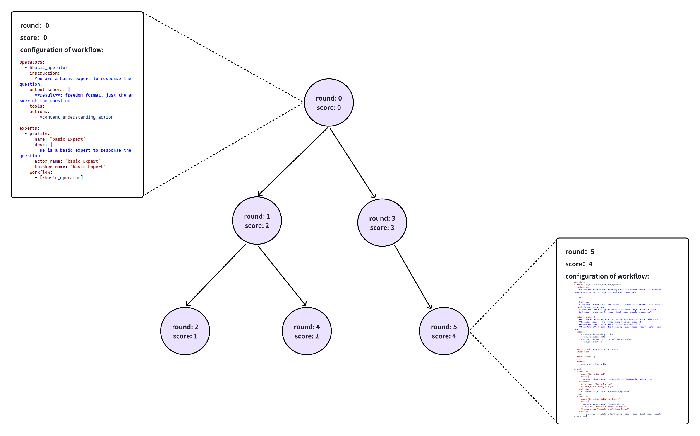

## 1. Introduction

The workflow auto generation module can, based on a concrete "task description", complete the end-to-end creation and optimisation of a workflow. Concretely, the module converts the task description into an executable agentic SDK configuration. The configuration specifies the definition and workflow of the agents; see [sdk](./sdk.md) for configuration details. The module consists of two parts:
- **Dataset Generator** (`app/core/workflow/dataset_synthesis`): provides the data foundation for workflow auto generation. It samples subgraphs, synthesises data with a large language model, filters the outputs, and produces a `WorkflowTrainDataset` for later evaluation. If you already possess your own dataset, you can skip synthesis and use it directly.
- **Workflow Generator** (`app/core/workflow/workflow_generator/mcts_workflow_generator`): starts from a base YAML configuration template and runs an MCTS-style iterative search. In each round the large language model refines operators/experts, and the generator finally returns the best round found during the search as a YAML configuration.
  
## 2. Design
### 2.1 Overall Flow
The overall framework and flow are shown below:


Detailed steps:
1. **Propose Requirement / Task Description**: the user provides a task requirement, e.g., “your task is to handle graph database query requests”.
2. **Data Synthesis (optional)**: given the requirement and a **prepared graph database**, synthesise a dataset with an LLM for subsequent training. **If you already have data, you can skip this step.**
3. **Specify Initial Workflow Template**: choose a YAML configuration file as the initial workflow.
4. **Workflow Auto Generation & Optimisation**: using the dataset and initial workflow, perform Monte Carlo Tree Search to generate and optimise the workflow automatically.
5. **Output Workflow**: the final optimised workflow is stored as an SDK configuration file.


### 2.2 Dataset Generator
The dataset generator synthesises datasets from task descriptions to provide the data foundation for workflow auto generation and fill training gaps. Its interface is:
```Python
class DatasetGenerator(ABC):
    @abstractmethod
    async def generate(
        self, task_desc: str, dataset_name: str, size: int
    ) -> WorkflowTrainDataset: ...
```

#### 2.2.1 Dataset Format
An example dataset:
```JSON
[
  {
    "level": "L1",
    "task_type": "query",
    "task_subtype": "Entity Attribute and Label Query",
    "task": "What is the city of residence for the person named Dietsce?",
    "verifier": "Chengde"
  },
  {
    "level": "L2",
    "task_type": "query",
    "task_subtype": "Multi-Step Chain Reasoning Query",
    "task": "Who is the owner of the account that received a deposit from the loan with ID '4866420872350534055'?",
    "verifier": "The loan with ID '4866420872350534055' was deposited into the account owned by the person named Yudhoyono."
  },
  ...
]
```
Field meanings:
- `level`: task difficulty, currently defined as L1/L2/L3/L4. See `app/core/workflow/dataset_synthesis/task_subtypes.py` for details.
- `task_type`: task category, either query or non-query. **The non-query path has not been implemented yet.**
- `task_subtype`: finer-grained task type.
- `task`: textual description of the task.
  - For query tasks, this is the actual question.
- `verifier`: used during evaluation to check whether the task was solved correctly.
  - For query tasks, the verifier equals the answer.
#### 2.2.2 LLM + Subgraph Sampling Dataset Generator
We implement a dataset generator based on LLMs and subgraph sampling. The **core idea** is to sample a local subgraph, let the LLM synthesise data from that subgraph to produce a preliminary dataset, then filter the results to obtain the final dataset.

The generator consists of three parts: `sampler`, `generator`, and `filter`, responsible for subgraph sampling, data synthesis, and data filtering respectively.


Key steps:
1. **Subgraph Sampling**: uses `RandomWalkSampler` by default to sample subgraphs through random walks. You can replace it with your own implementation.
    - Choose a starting node: randomly pick an unsampled node.
    - Perform multiple walk steps (up to `max_depth`):
        - Use the current frontier to query neighbours via Cypher.
        - Balance “depth exploration” (DFS) and “breadth expansion” (BFS) with a random `dfs_bias`.
        - Sort by weight, pick new nodes/edges without exceeding the remaining limits.
    - Serialise the sampled subgraph.
2. **Data Generation**: embed the sampled subgraph into a prompt and call the LLM to synthesise data.
3. **Filtering**: use the LLM to filter out hallucinations and invalid samples.


### 2.3 Workflow Generator
The workflow generator produces and optimises workflows, ultimately outputting an optimised SDK declarative configuration file `workflow.yml`, which describes the system’s `experts` and their `workflow`s.

The implementation references the Aflow paper. Its **core idea** is to use an MCTS-based search framework to generate and refine workflows.
- The original method is adapted to Chat2Graph’s SDK declarative configuration, shifting from “generate & optimise code” to “generate & optimise configuration”.
- During expansion/optimisation the process uses hierarchical optimisation. “Prompt engineering” controls the context of each layer to mitigate hallucinations.

#### 2.3.1 Modelling
The overall modelling is shown below:

Specifically:
- **Representation of workflow / agentic system**: Chat2Graph’s declarative configuration describes the entire agentic system/workflow. **In this subsection, “workflow” is equivalent to “configuration file”.** See [sdk](./sdk.md) for the configuration contract.
- **Nodes in the search tree**: every node represents **a complete configuration file**, i.e., a full workflow/agentic system.
    - Each node also stores evaluation scores, feedback, and other context to guide future optimisation.
- **Search framework**: Monte Carlo Tree Search loops through selection → expansion → evaluation → feedback to iteratively improve the initial configuration.

#### 2.3.2 Key Steps / Iteration
- **Initialisation**
- **Iterative Optimisation**
    1. **Select Workflow**: the `selector` chooses a node from the current search tree.
    2. **Optimise Workflow**: the LLM refines the selected node. The implementation uses hierarchical optimisation: generate optimisation suggestions, then separately refine the `operator` and `expert` sections.
    3. **Execute Workflow**: run the newly generated workflow on the dataset and record execution results.
    4. **Evaluate Workflow**: evaluate the execution with an LLM, reflect on the outcome, and produce iterative suggestions.
    5. **Backpropagate**: store score, reflection, modifications, feedback, and action suggestions in the logs, and propagate feedback to the parent node.
- **Output the Best Workflow**

## 3. APIs and Usage Examples
### 3.1 Dataset Generator
The dataset generator exposes:
```Python
class DatasetGenerator(ABC):
    @abstractmethod
    async def generate(
        self, task_desc: str, dataset_name: str, size: int
    ) -> WorkflowTrainDataset: ...
```
Parameter descriptions:
- `task_desc`: task description.
- `dataset_name`: name of the synthesised dataset.
- `size`: target dataset size.


The constructor of our concrete dataset generator is:
```Python
class SamplingDatasetGenerator(DatasetGenerator):
    def __init__(
        self,
        graph_db: GraphDb,
        sampler: SubGraphSampler,
        strategy: GENERATOR_STRATEGY = None,
        max_depth: int = 2,
        max_noeds: int = 10,
        max_edges: int = 20,
        nums_per_subgraph: int = 10,
```
**Parameter descriptions:**
- `graph_db`: graph database connection.
- `sampler`: concrete subgraph sampler; you can implement your own algorithm (strategy pattern).
- `strategy`: dataset generation strategy—`"query"`, `"non-query"`, or `"mixed"`, meaning query-only, non-query-only, or mixed.
- `max_depth`: maximum depth of sampled subgraphs.
- `max_noeds`: maximum number of nodes in each sampled subgraph.
- `max_edges`: maximum number of edges in each sampled subgraph.
- `nums_per_subgraph`: number of samples generated per subgraph during synthesis.

**Usage example:**
```Python
db = register_and_get_graph_db()
dataset_generator: DatasetGenerator = SamplingDatasetGenerator(
    graph_db=db,
    sampler=RandomWalkSampler(),
    strategy="query",
    max_depth=5,
    max_noeds=15,
    max_edges=30,
    nums_per_subgraph=10,
)

train_set = await dataset_generator.generate(
    "你的主要职责是解决关于图数据库的各种问题，包括实体查询、多跳推理等等",
    dataset_name="test",
    size=10,s
)
print(f"train_set={train_set}")
```


### 3.2 Workflow Generator
The abstract interface of the workflow generator is:
```Python
class WorkflowGenerator(ABC):
    """Interface that all workflow generators must implement."""

    @abstractmethod
    async def generate(self) -> WorkflowGenerationResult:
        """Execute the generation procedure and return the best found workflow."""
```
Different implementations may exist, so the parameters are passed through concrete constructors.


The constructor of our `MCTSWorkflowGenerator` is:
```Python
class MCTSWorkflowGenerator:
    def __init__(
        self,
        db: GraphDb, 
        dataset: WorkflowTrainDataset, 
        selector: Selector, 
        expander: Expander, 
        evaluator: Evaluator, 
        optimize_grain: List[AgenticConfigSection], 
        init_template_path: str = "./init_template/basic_template.yml", 
        max_rounds: int = 30, 
        optimized_path: str = "workflow_space", #
        top_k: int = 5, 
        max_retries: int = 5, 
    ):
```
**Parameter descriptions:**
- `db`: graph database.
- `dataset`: dataset content, including `name`, `task_desc`, and `data`.
    - **Note**: `name` is combined with `optimized_path` to form `${optimized_path}_{name}` as the working directory storing all outputs.
- `selector`: chooses a node.
- `expander`: expands the selected node.
- `evaluator`: evaluates the expanded workflow.
- `optimize_grain`: which parts to optimise (operators, experts, actions, tools). **Not used yet**—currently only operators and experts are supported.
- `init_template_path`: path of the initial template.
- `max_rounds`: maximum iterations.
- `optimized_path`: combined with the dataset name to form the working directory containing each round’s `workflow.yaml` and `result.json`.
    - **Example**: if the script runs in `/home/example.py`, `dataset.name = test`, and `optimized_path = "workflow_space"`, then round 4 creates `/home/example/workflow_space/test/round4` with that round’s `workflow.yaml` and `result.json`.
- `top_k`: number of nodes sampled from the tree.
- `max_retries`: maximum retries when errors occur.

**Usage example:**
```Python
selector = MixedProbabilitySelector()
expander = LLMExpander()
evaluator = LLMEvaluator()

# Define the MCTS search framework
workflow_generator = MCTSWorkflowGenerator(
    db=db, 
    dataset=dataset, 
    selector= selector, 
    expander=expander, 
    evaluator=evaluator,
    max_rounds=3,
    optimized_path=Path(__file__).resolve().parent / "workflow_space",
    top_k=5,
    max_retries=5,
    optimize_grain=None,
    init_template_path="app/core/workflow/workflow_generator/mcts_workflow_generator/init_template/basic_template.yml"
    )

# Entry point of the MCTS main loop
await workflow_generator.generate()   
```
## 4. Detailed Usage Examples and Tests
**Complete usage examples**
> **Prerequisites**
> 1. Configure the graph database.
> 2. Ensure the database has sufficient data, depending on the subgraph sampling scale.
>    
>    You can use the Neo4j Docker image below to obtain the graph database used in our experiments. It imports the Finbench sf1 dataset:
>    todo
>

- `test/example/workflow_generator/dataset_generator_example.py`: full example of using the dataset generator.
- `test/example/workflow_generator/workflow_generator_example.py`: full end-to-end example of using the workflow generator.


**Unit tests**: implemented with mocks; no database connection required.
- `test/unit/workflow_generator/test_dataset_generator.py`: dataset synthesis unit tests.
- `test/unit/workflow_generator/test_workflow_generator.py`: workflow auto generation unit tests.

 
