# **第三章 系统需求分析与设计**

## 3.1 问题定义

本节将用形式化的方式详细阐述问题定义。

在第一章和第二章中已经阐述了目前图数据库智能体的设计与编排需要人工参与且耗费人力，因此亟需一种自动生成的方式来完成图数据库智能体设计与编排。本研究的目标是实现通过自然语言描述来自动生成与编排图数据库智能体，并且生成的智能体能够完成用户指定的与图数据库相关的任务。

具体来说，本研究旨在设计并实现一个图数据库智能体的自动生成与编排系统，实现图数据库智能体设计与编排的自动化，加快图数据库智能体的设计与编排过程，解放人力。其形式化的定义如下：

任务描述（T），自然语言描述的与图数据库相关的问题，例如“你的任务是帮助我完成图数据库中的多跳查询任务”。

工具集（U），代表系统可用的所有工具的集合，例如图数据库的查询接口、最短路算法、数据可视化工具等。

数据集（D），用于验证智能体在执行对应任务效果好坏的数据，例如多跳推理问答对数据集。

图数据库（G），跟数据集D相关联的图数据库，即数据集中的问答对相对应的原始图数据库，也可以认为是问答对的数据来源。

智能体（A），一个智能体包括提示词prompt与其可以调用的工具u，例如简单查询智能体的提示词为“你的任务是根据用户的要求到图数据库中进行简单查询”，可以调用的工具为图数据库查询接口。

智能体的编排（W），通过有向无环图（DAG）表示的智能体执行的工作流与智能体之间的编排，𝐷𝐴𝐺(𝐴1,𝐴2,…,𝐴𝑘)表示了多个智能体间的依赖关系与执行顺序。

评估函数（E），用于评估智能体编排效果的函数。

本研究的目标可以形式化描述为，在指定任务描述T、图数据库G、数据集D、工具集U下，找到最优智能体及其编排𝑊∗\=𝐷𝐴𝐺(𝐴1,𝐴2,…,𝐴𝑘)，使得评估函数𝐸(𝐴∗,𝑇,𝐷,𝐺,𝑈)最大。

  

## 3.2 需求分析

### 3.2.1 功能性需求
从用户角度出发，用户使用该系统最大的愿望就是希望能通过自然语言生成图数据库智能体，完成其任务。因此，最核心的功能就是智能体的自动生成与编排功能。
在生成了智能体系统之后，需要有一个智能体的管理模块来管理这些生成的智能体系统，方便对智能体进行修改、删除、增加、查看历史对话记录。因此需要有一个智能体管理的模块来帮助完成智能体的crud等操作。
在完成智能体的生成之后，需要能够运行智能体本身进行交互，因此还有智能体的运行时需要设计。
因此，系统需要有三个核心组成部分：
（1）智能体的自动生成与编排算法
（2）智能体的管理模块
（3）智能体的运行时
  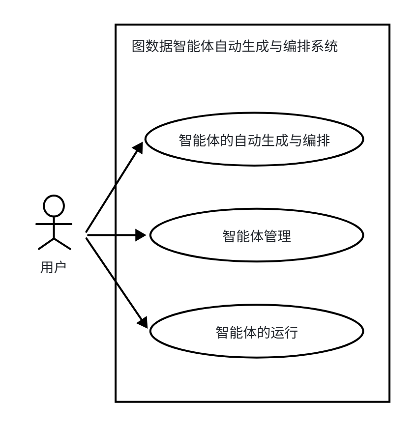

### 3.2.2 非功能性需求
非功能性需求主要关注系统的性能方面。在本文研究的系统中非功能性需求主要关注的指标是响应时间、token消耗成本两方面。

响应时间主要关注数据合成的响应时间与图数据库智能体的自动生成响应时间。数据合成的响应时间指从用户提出任务描述，并指定数据集规模，到数据集生成结束所需要的时间，设为T1。图数据库智能体的自动生成响应时间则是指用户从输入任务的自然语言描述到生成对应的智能体所需要的时间，设为T2。由于在使用我们系统的时候，用户可能已经准备好数据集，也可能尚未准备好数据集，因此从用户输入自然语言描述到生成一个可用的智能体的最差时间大约是T=T1 \+ T2 ，T的值越小，图数据库智能体的自动设计与编排效率就越高。由于系统其中一个目标是提高智能体设计与编排的效率，因此T应当要小于人工设计一个智能体的时间。对于简单智能体，T应当几个小时之内完成任务。对于复杂智能体，T应当能够在一到两天内完成任务。

token消耗成本主要关注数据合成消耗的token以及图数据库智能体自动生成消耗的token。在利用大模型进行数据合成过程中，需要通过API接口调用大模型进行数据合成，这个过程有一定的花费。同理，在图数据库智能体的自动生成过程中，也需要大模型的参与，并且在最后的智能体评估过程也可能基于大模型进行评估。整个过程需要耗费一定量的token，因此具有一定的成本。整个过程消耗的token应当小于人力成本，否则系统的实用性大大降低。

## 3.3 系统设计

### 3.3.1 系统功能设计

根据用例图，我们可以把系统的功能模块分成图数据库智能体的自动生成与编排、图数据库智能体的管理、图数据库智能体的运行环境三个模块，每个模块含有若干个子功能，如图4所示。

  
图数据库智能体的自动生成与编排模块主要负责从用户的自然语言描述出发，自动生成并编排智能体，并且根据用户指定的数据集对生成的智能体进行评估，根据评估的反馈迭代优化智能体，最终得到一个能够完成用户指定任务的图数据库智能体系统。在智能体的自动生成与编排模块中，有一个数据合成的子功能。数据集合成子功能负责数据集的合成，其主要用来弥补图数据库领域的数据集的不足。该模块需要根据用户的任务描述，合成跟任务相关的数据集。由于用户的描述可能是一个具体的任务，也可能是一类抽象的任务，例如“帮我查询小明的出生日期”是一个具体的任务，而“你的任务是做图数据库的简单属性查询”则是一类抽象的任务，这两个查询都属于是简单属性查询这一类任务。因此该模块需要具有意图识别的功能，正确识别出用户提出的任务描述所属的任务类型，从而合成与之类似的数据作为评估数据集。

图数据库智能体管理模块主要负责管理自动生成的智能体，包括智能体删除、智能体查看、智能体修改、智能体的添加、运行记录的查看等等，方便用户对已经生成的智能体进行复用与修改，查看历史运行记录。

图数据库智能体的运行环境主要负责管理图数据库智能体的运行的整个生命周期。具体来说，图数据库智能体的运行环境需要完成图数据库智能体的启动与初始化、自定义配置的加载、会话的管理、多智能体的调度、工具的集成、记忆的管理、图数据库的连接、运行的可观测性等等。同时，智能体运行模块还应该提供一个自然语言接口，使用户能够跟智能体进行交互。

  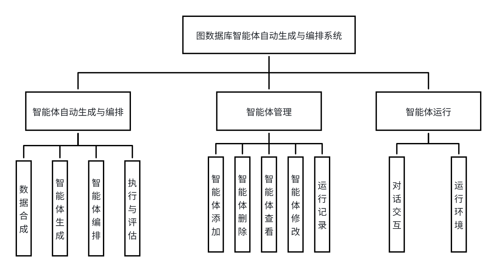

  

### 3.3.2 系统框架设计

  
基于系统功能设计，整个系统框架按照功能模块进行了设计，采用自上而下的分层架构设计，，主要包括前端交互层、智能体生成与管理层以及图数据库智能体运行环境三部分，如下图所示。该设计的核心思想是将生成逻辑与运行时执行解耦：上层负责用户交互和系统配置管理，中间层负责智能体的自动生成与编排流程，下层则提供稳定的运行时环境与图数据库支撑，从而形成清晰的职责划分与可扩展的系统结构。

最上层为前端交互层，负责接收用户的自然语言输入、展示生成结果与运行反馈。用户仅需通过自然语言描述任务需求，然后完成图数据库智能体的自动生成与编排；也可以通过自然语言与已经生成的图数据库智能体进行对话，完成智能体的使用。系统对用户隐藏复杂的生成与优化细节，使交互保持简洁直观。该层承担系统入口与信息展示功能，也是后续功能可视化与可用性优化的基础。

中间层为系统核心，包括智能体自动生成与编排模块与智能体管理模块两部分。其中，智能体自动生成与编排模块采用基于蒙特卡洛树搜索框架的智能体生成算法，包含基于子图采样的数据合成、基于蒙特卡洛树搜索的智能体自动生成与编排算法，以及智能体的执行与评估。该算法框架能够完成数据合成、智能体生成、智能体编排、智能体执行、智能体评估与反馈的闭环，实现智能体的自动生成与编排。

智能体管理模块是面向系统内部资产的管理模块，支持智能体的添加、删除、查看与修改，并记录运行历史。这一设计用于沉淀高质量配置，方便后续复用与对比，同时保证自动生成结果具备可追溯性。相较于传统后台管理系统的复杂功能，本系统的管理能力仅保留必要的配置与历史维护，强调对生成流程的支撑与持续优化。

最下层为图数据库智能体运行环境，由Chat2Graph作为运行时引擎，图数据库作为数据支撑。系统生成的智能体配置最终交由Chat2Graph执行，运行过程中需要访问图数据库完成查询、分析等任务，并将执行结果返回给生成模块用于评估与反馈。该层提供稳定的执行能力，保证生成配置可以落地运行，从而实现系统端到端闭环。

整体而言，该系统框架实现了从自然语言输入到智能体生成、运行与评估的完整链路，为图数据库智能体的规模化构建提供了系统性支撑。

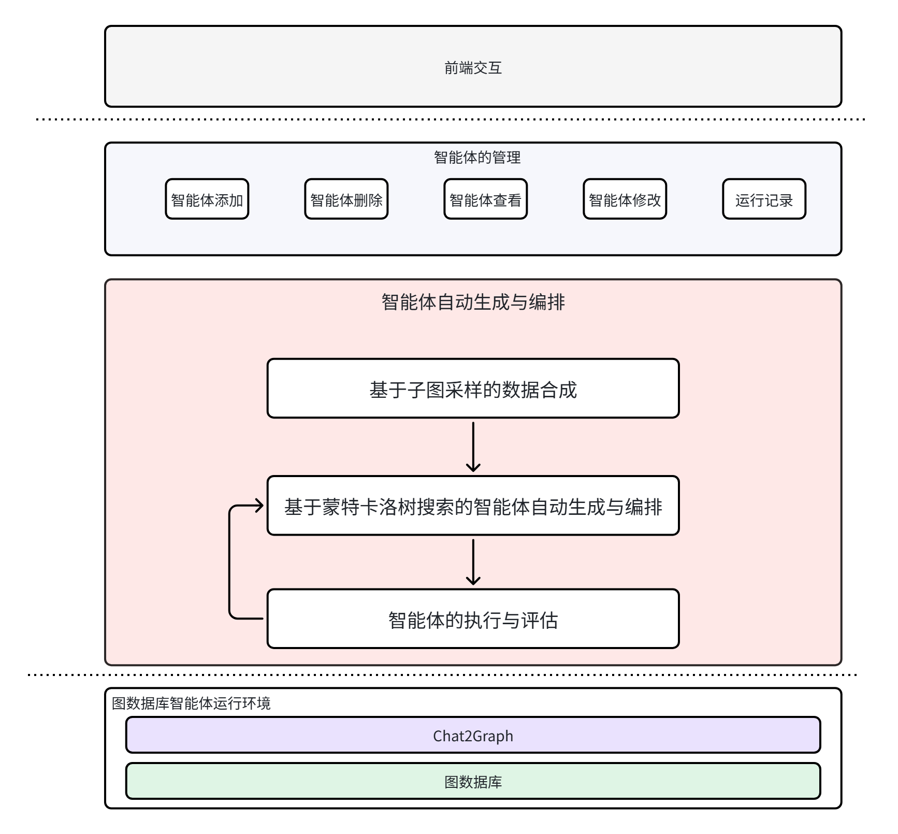

  

## 3.4 图数据库智能体的运行环境

  

本系统构建的图数据库智能体运行环境基于 Chat2Graph 与图数据库共同完成。由于本文关注的是智能体的自动生成与编排，而非重新实现底层运行引擎，因此在运行阶段直接复用 Chat2Graph 已有的图数据库智能体框架与工具能力。在系统输出层面，本系统将自动生成的智能体配置映射为 Chat2Graph 支持的 SDK 配置文件，通过该配置文件完成系统定义的智能体与工作流在运行环境中的加载与执行。

  

具体而言，系统输出的配置文件包含智能体的指令、工具绑定、输出格式以及多智能体编排关系等信息。该配置文件作为运行时的中间表示，起到图数据库自动生成与编排算法与运行环境之间的桥梁作用。一方面，它将自动生成的智能体结构转化为 Chat2Graph 可以解析与执行的声明式配置；另一方面，它保证了运行时逻辑的可复用性，使得不同任务的智能体系统可以通过配置切换实现快速部署。运行环境在加载配置后，由 Chat2Graph 的运行时引擎负责调度智能体与调用工具，图数据库提供数据与算子支撑，最终完成用户任务。

  

该设计既降低了运行环境的开发成本，又使自动生成的智能体能够在稳定、成熟的框架中运行，保证了生成结果的可执行性与工程可落地性。图6展示了系统生成配置与运行环境之间的对应关系。

  

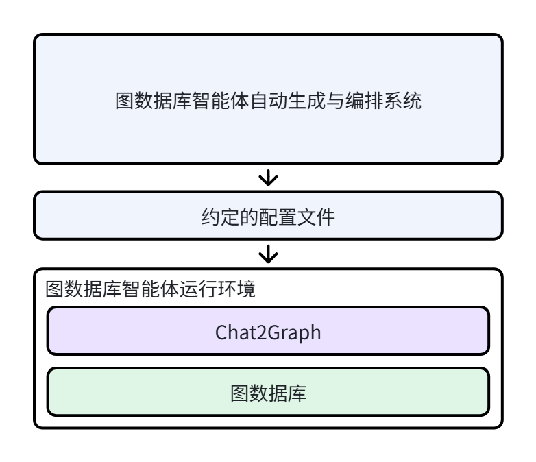

  

## 3.5 图数据库智能体的自动生成与编排

  

图数据库智能体的自动生成与编排是本系统的核心模块，承担从任务描述到可执行智能体配置的关键转化过程。本节首先给出图数据库智能体及其编排的表示方法，以明确系统中智能体的基本组成与多智能体协作关系；随后对搜索树进行建模，说明自动生成过程中的配置空间如何被结构化表示；接着介绍基于子图采样的数据合成机制，为后续生成与评估提供任务约束与评估基础；在此基础上，给出智能体自动生成与编排算法框架，并依次展开节点选择器、基于大模型的优化器、执行器与评估器各个组件的设计与作用。

  

### 3.5.1 图数据库智能体及其编排的表示方法

  

本节首先阐述智能体的表示方法，约定如何通过YAML配置文件定义智能体；在此基础上，再阐述如何通过YAML文件定义多智能体的编排。

  

在本系统中，每一个图数据库智能体都可以通过一段YAML配置文件进行描述，其包含的字段如表2所示。如3.1节中所述，智能体的定义既需要刻画其身份与职责，也需要约束其输出形式与可调用工具，以保证多智能体之间能够正确协作。因此，一个智能体的配置由四类核心字段组成，名称、指令、输出格式和工具集合。其中，指令用于描述智能体的角色定位、任务边界与执行步骤，是智能体行为的主要控制信息；输出格式用于约定结构化输出格式，保证下游智能体或执行器能够稳定解析；工具集合则限定智能体可调用的工具集合，防止越权或不可执行操作。该定义方式既保持了智能体配置的可读性，也为自动生成提供了明确的结构化约束。

  

| 字段名 | 描述 |
| :--- | :--- |
| name | 图数据库智能体的名称 |
| instruction | 图数据库智能体的提示词，用于给图数据库智能体定义身份、执行过程等信息。 |
| output_schema | 约定的输出格式，可以通过json schema来约定输出格式。 |
| tools | 该字段是一个数组，指定了智能体能调用的工具有哪些 |

  

为便于理解，图9给出了一个简化示例。该示例描述了一个图数据库查询智能体，其instruction部分明确指出该智能体需要完成实体识别与Cypher查询生成；output_schema定义了输出中必须包含查询语句与查询结果；tools则限定其只允许调用查询执行工具。通过这种形式，智能体的行为边界、输出格式与可调用能力被明确绑定，从而保证后续编排与执行的可控性。

  
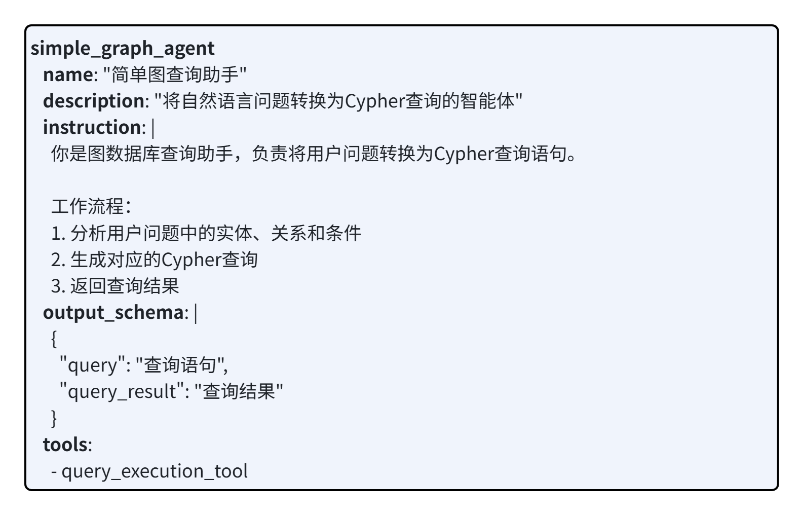

  

多智能体的编排采用工作流（DAG）进行表示。系统通过 YAML 配置描述多个智能体之间的执行顺序与依赖关系，将复杂任务拆解为若干子任务并形成可执行链路。该表示方式在结构上清晰、便于自动生成，也便于后续的优化与评估。图10展示了一个简单编排示例，工作流由多条顺序链路构成，最终在图结构中体现为有向无环的执行关系。

  

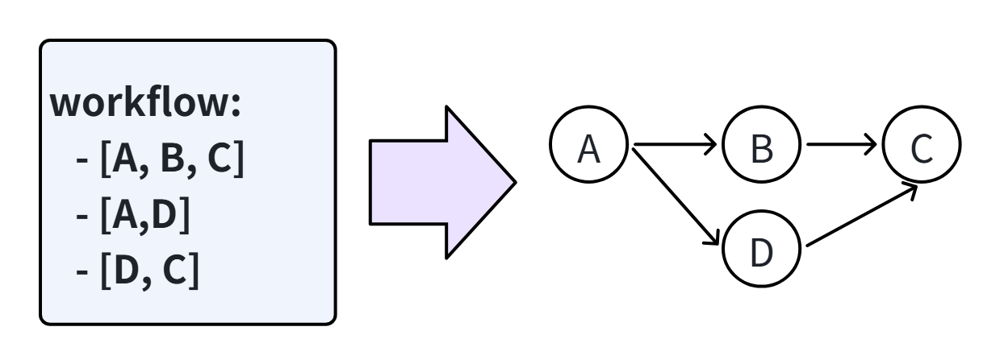
  

### 3.5.2 搜索树的建模

  

本研究的图数据库智能体自动生成与编排算法以蒙特卡洛树搜索为核心，因此首先需要对搜索树进行形式化建模。根据 3.5.1 节的定义，系统使用配置文件描述智能体及其编排关系，因此自动生成与编排的本质是在配置空间中进行结构化搜索与优化。基于这一理解，可以将搜索树定义为对配置空间的离散化表示，其基本元素如下：

  

（1）根节点表示初始配置文件，是搜索空间的起点，通常由人工指定的基础模板或初始智能体集合构成；

  

（2）节点表示一份完整配置文件，它能够完整刻画一个图数据库智能体系统，包括智能体定义（指令、工具、输出格式等）以及多智能体之间的编排关系；

  

（3）边表示从父配置到子配置的一次变换操作，该操作可包括智能体新增/删除、提示词调整、工具绑定更新、输出格式约束修改以及编排拓扑结构变化等。边上可记录操作类型与修改幅度，便于后续分析与反馈利用。

  

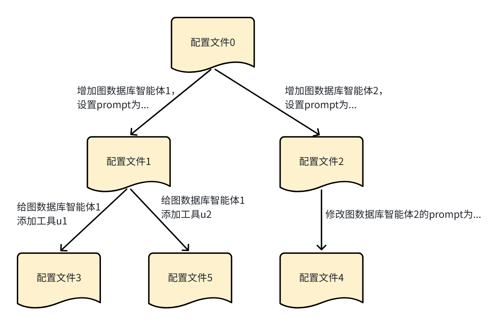

  

由上述建模可知，搜索树中的每一条路径对应于配置文件的逐步演化过程，反映了智能体系统从初始状态到候选方案的优化轨迹。例如图9中展示了一个具体的配置演化过程，根节点配置记为配置文件 0；在配置文件 0 的基础上新增智能体 1，得到配置文件 1，配置文件 0 为其父节点；在配置文件 0 上新增智能体 2，得到配置文件 2，配置文件 0 为其父节点；在配置文件 1 中为智能体 1 添加工具 u1，得到配置文件 3，配置文件 1 为其父节点。由此可见，该搜索树刻画了配置文件的结构化演化过程，具有类似“配置版本树”的性质。

  

此外，搜索树的建模为后续蒙特卡洛树搜索四阶段提供了统一表示，选择阶段在当前树结构中挑选扩展目标节点；扩展阶段通过对配置文件的局部修改生成新节点；评估阶段在运行环境中执行并获得质量反馈；反向传播阶段将评价信号回传至父节点并更新其统计信息。通过这种结构化建模，自动生成过程不再是无约束的文本生成，而是有组织的配置空间搜索，从而保证了生成结果的可控性与可解释性。

  

### 3.5.3 智能体的自动生成与编排算法

  

图数据库智能体的自动生成与编排算法是本系统的核心算法。本文将智能体生成与多智能体编排统一建模为配置空间中的搜索与优化问题，并以蒙特卡洛树搜索作为全局求解框架，通过选择、扩展、评估、反馈四阶段循环迭代，持续提升候选配置质量。前文 3.5.1 已给出智能体及其编排的表示方式，3.5.2 已完成搜索树建模，因此本节优化对象可统一表示为一份可执行的YAML配置文件。算法以初始配置为根节点，围绕配置的局部修改生成候选方案，并以执行结果作为反馈信号驱动后续优化，最终输出质量最优的图数据库智能体系统配置。

  

与依赖静态模板或固定评测集的方法不同，本系统将数据合成模块显式纳入算法闭环，形成数据合成、生成优化、执行评估、反馈迭代的统一流程。具体而言，数据合成模块基于子图采样构造与任务描述匹配的评估样本，为后续执行与评估提供稳定且任务相关的反馈基础；节点选择器在当前搜索树中选择待拓展节点，兼顾高分优先与必要探索，避免过早收敛到局部最优；基于大模型的优化器对选中配置进行局部改写，分别作用于智能体定义与编排结构，实现“能力层—协作层”的协同提升；执行器将新配置映射为可运行的多智能体系统，并在合成样本上运行，产出可观测的执行结果与过程轨迹；评估器对结果进行评分与反思，输出结构化反馈信息回传至后续迭代，同时记录优化轨迹以支持分析与复用。

  

从设计思想上看，该算法强调三点。第一，统一优化对象，将生成与编排统一到配置空间。第二，闭环生成与评估反馈，不将优化视为一次性生成，而是通过执行结果持续修正配置，使优化方向由数据与结果共同约束。第三，可解释与可追踪，搜索树节点、配置改动与评估反馈均可被记录，形成可解释的优化路径，便于问题定位与方案复用。

  

该算法框架的创新主要体现在两个方面：其一，将智能体生成与编排统一为配置空间搜索问题，建立了可执行、可追踪、可迭代的优化机制；其二，在基于大模型的生成与优化器中采用分层优化策略，将配置改写分为智能体优化和编排优化两个层次，通过分步约束优化范围与上下文范围，提升优化过程的可控性与稳定性。基于上述设计，该算法能够在配置空间中持续搜索不同的智能体设计方案方案，实现图数据库智能体的自动生成与编排。

  
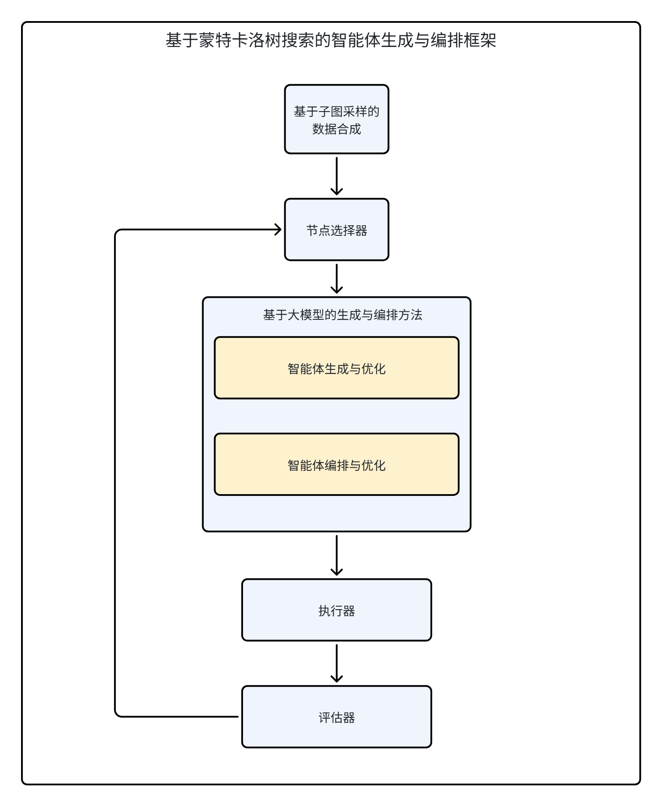

  

### 3.5.4 基于子图采样的数据合成

  

数据合成是本系统自动生成与编排流程中的关键支撑环节，其意义在于为后续智能体生成与评估提供稳定、可控且与任务描述一致的评估数据基础。在图数据库领域，公开数据集匮乏且领域差异显著，若缺乏任务相关的评估样本，生成过程难以形成有效反馈，从而导致智能体配置优化不稳定。因此，数据合成不仅是补足数据稀缺的手段，更是保证自动生成闭环有效运行的基础条件。本节首先定义系统中数据集样本的格式；随后给出基于子图采样的数据合成流水线，分别说明意图识别、子图采样、数据生成与混合过滤的实现逻辑。

  

（1）数据格式定义

  

本系统中的数据样本以问答对或任务为单位，每条记录由六个字段构成，分别是task、task_type、sub_type、level、verifier，每个字段的详细描述如表1所示。 该格式既支持数据合成过程中的任务约束，也支持评估阶段的精细化分组与统计，使得系统能够在不同任务类型和难度层级上进行针对性的优化与对比。

| 字段名 | 描述 |
| :--- | :--- |
| task | 任务或者问题的自然语言描述 |
| task_type | 任务的类型，例如查询与非查询 |
| sub_type | 任务的子类型，例如简单实体属性查询 |
| level | 任务难度等级，如L1、L2 |
| verifier | 问题对应的真实的答案 |

  

一个具体的数据例子如下所示，该例子中的问题是Adella Jubilee目前是否持有贷款，其对应的任务类型为查询类，子类型为单步推理查询，难度为L1，而verifier则是该问题对应的答案。

  
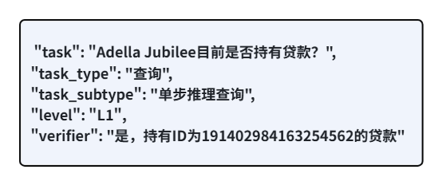

  

（2）基于子图采样的数据合成流水线

  

数据合成流程采用意图识别、子图采样、数据生成、混合过滤的流水线结构，如图11所示。该数据合成方法的核心思想是在图数据库中进行采样得到一个局部子图，把局部子图作为答案反推问题。

  

意图识别模块主要用于从用户的任务描述中抽象出任务的类型，合成相关任务的数据集。因为用户可能通过不同的提问方式来使用系统，普通用户可能更关注具体任务，例如请帮我查询一下小明的生日，而有一定智能体知识的用户可能会以抽象任务或者某一类任务作为自然语言描述输入，例如你的任务是完成简单实体属性查询。但本质上这两种提问方式对应的任务需要合成的数据集是类似的，都属于简单实体属性查询的数据集，因此需要由一个意图识别模块来完成用户意图的识别。

  

子图采样模块主要用于在图数据库中抽取某一个局部子图，减少数据量。因为大模型的上下文是有限的，而图数据库的数据量可能非常大，无法将整个图数据库的数据作为上下文传递给大模型。因此我们只能抽取一部分数据，将局部子图作为上下文传递给大模型。子图采样模块要求能够从图数据库中采样一个连通的局部子图，且多次采样之间尽可能采样出不同的模式，保持子图的多样性，为大模型进行数据合成提供多样性的基础。

  

基于大模型的数据生成器则利用大模型和采样得到的子图进行问答对的生成，生成的问答对应当与用户提出的任务描述有相关性或者是同一类问题。由于大模型进行数据合成会倾向于合成相似的数据，因此需要有控制数据多样性的手段。

  

过滤器则负责校验与过滤大模型合成的数据，主要包括基于规则的规律和基于大模型的规律。基于规则的过滤主要过滤一些因数据合成方法本身缺陷导致的错误数据，例如包含统计的问答对，因局部统计与全局统计的不一致性，该类问题从局部采样得到的答案是错误的，因此应当过滤这部分数据。基于大模型的过滤主要是利用大模型的再见校验一下合成的数据是否产生了幻觉，将产生了幻觉的错误数据进行过滤。但是幻觉问题是无法完全避免的，采样的子图规模越大，模型的幻觉越重，因此只能降低幻觉而无法消除幻觉。

  

这四个模块相互配合，构建了从用户的任务描述到数据集的数据合成流水线。该模块合成的数据集能够被数据集管理模块所管理，方便后续的复用，并为后续的图数据库智能体的自动生成与编排提供评估数据基础。

  

  

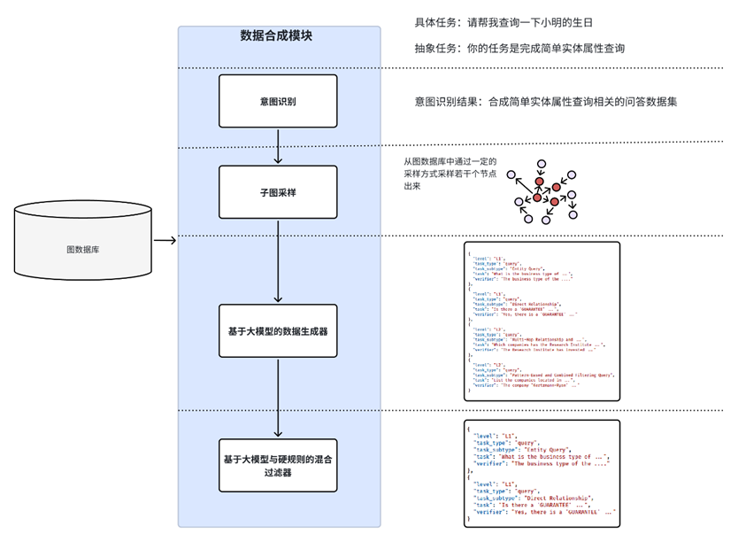

  

### 3.5.5 节点选择器

  

节点选择器负责从搜索树中选择一个已有节点作为拓展目标进行优化，其选择依据是节点的评估得分。在传统蒙特卡洛树搜索中，常用上置信界（UCB）作为节点价值估计，但在本系统中，搜索对象是完整的智能体配置文件，搜索空间大且结构复杂。如果仅依赖高分节点进行贪心式扩展，容易陷入局部最优并导致配置结构趋于单一；若完全随机选择，又会显著降低收敛效率。因此，选择器需要在高分优先与结构多样性之间取得平衡。

  

基于上述考虑，本系统采用了均匀分布与评分驱动的混合概率采样策略。其核心思想是：一方面保留一定比例的均匀随机选择，确保低分节点仍有被探索的机会；另一方面引入评分驱动项，使高分节点被选中的概率更高，从而保证优化方向的收敛性。该策略可表示为如下形式（公式略）：

  

P(v) = λ · Uniform(v) + (1−λ) · Softmax(α · score(v))

  

其中，λ 控制探索下界，α 控制对评分差异的敏感度。当 λ 较大时，系统更倾向于探索多样性；当 α 较大时，高分节点的优势更明显。通过调整这两个参数，可以在不同任务场景下平衡“探索”与“利用”。该混合策略保证了即便某些节点得分较低，仍然具有被选中的非零概率，从而在一定程度上避免陷入局部最优，同时保留编排结构的多样性。

  

### 3.5.6 基于大模型的智能体生成与编排方法

  

该模块是自动生成与编排流程中的核心模块，其职责是从当前被选中的配置文件出发，生成并优化新的候选配置。根据3.6.1节的定义，系统中的图数据库智能体由 YAML配置文件统一描述，配置文件同时承载两类关键信息：一类是单个智能体的定义与优化，如角色定位、提示词、可调用工具、输出约束；另一类是多智能体之间的编排关系。因此，该模块的设计目标并非对配置进行无约束修改、扩写或者优化，而是在可控条件下完成智能体的生成与优化以及智能体编排生成与优化，保证新配置仍然具备可执行性与可评估性。

  

从设计思想上看，该模块采用分层生成、分层优化的策略。采用分层策略的根本原因在于减少端到端优化的上下文噪声，提高可控性。智能体定义与编排关系虽然相关，但上下文关注点不同，前者关注单个智能体的指令，可用的工具，因此其依赖于系统的工具集作为上下文；而后者关注多个智能体之间的执行关系，其依赖的上下文是系统中存在的智能体，两者所依赖的上下文不同。如果在一个步骤中同时进行全局修改，模型容易受到无关上下文干扰，导致改写范围过大、结构稳定性下降、容易出现幻觉等问题。分层后，每一层只处理与自身直接相关的信息，能显著降低优化过程中的随机性与幻觉出现的概率。

  

具体而言，第一层为智能体生成与优化。该层面向单个智能体能力本身，负责生成或修正其提示词、工具绑定策略与输出格式约束。其目标是明确每个智能体做什么、如何做、输出什么，使单体定义在语义上清晰、在结构上完整、在运行上可执行。该层优化完成后，系统得到一组能力边界明确的智能体定义，为后续编排提供稳定输入。

  

第二层为编排生成与优化。该层在智能体定义已确定的基础上，重点调整多智能体之间的执行顺序、依赖关系和协作链路，确保任务流转路径与逻辑一致。其目标不是追求拓扑复杂度，而是保证协作结构与任务需求匹配，避免出现依赖断裂、重复执行或无效链路。通过先定义后编排的顺序，系统能够降低结构冲突的概率，保证编排修改始终建立在最新且有效的智能体定义之上。

  

因此，为保证智能体的生成与优化过程的稳定性，模块在设计中引入三类控制机制。第一类是上下文控制，每一层优化仅能访问其直接依赖信息，避免无关信息引发错误联想与过度改写。第二类是修改幅度控制，限制每轮可修改范围与改动强度，抑制大幅度重写导致的性能波动。两类机制共同保证优化过程具有局部改写、逐步收敛的特征，提高系统在多轮迭代中的稳定性。

  

综合来看，该模块的核心价值在于建立了一个可控、可解释、可持续迭代的生成与优化机制：以分层策略保证结构一致性，以反馈约束保证改写方向性，以稳定性控制保证迭代可靠性。由此，系统既保留了大模型在结构生成上的灵活性，又避免了无约束生成带来的不稳定问题，为后续执行与评估环节提供高质量、可复用的配置入。

  

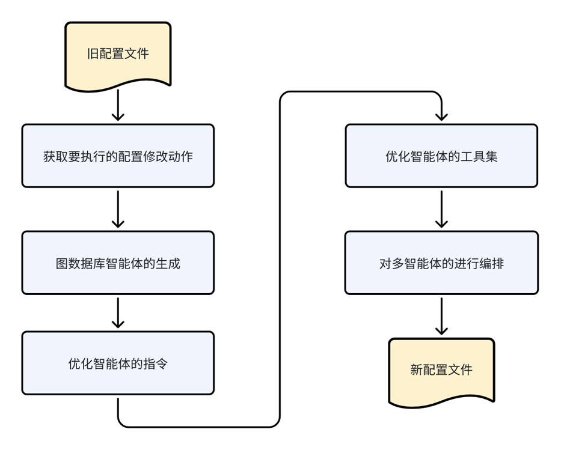

  

### 3.5.7 执行器

  

执行器负责将优化器输出的新配置映射为可运行的图数据库智能体系统，并在评估数据上完成任务执行。其核心作用是把配置层改动转化为可观测执行结果，为后续评估提供统一输入。

  

在本系统中，执行器主要完成三个步骤：首先加载当前轮次生成的配置文件并构建智能体系统；然后在给定任务数据上运行该系统，得到模型输出与运行状态；最后对执行结果进行统一整理与保存，形成可用于评估的标准化结果记录。

  

从设计角度看，执行器不参与配置优化决策，仅负责保证每轮候选配置在一致条件下被验证。通过这一设计，系统能够将每轮配置改动与对应执行效果建立稳定映射，避免优化过程停留在文本改写层面，从而为评分与反馈迭代提供可靠基础。

  

### 3.5.8 评估器

  

评估器负责对执行器产出的结果进行评估打分，并生成可用于下一轮迭代优化的反馈信息。根据图14，评估模块由两部分组成：基于大模型的评估器与基于大模型的反思机制，二者共同形成评估、反思、存储的闭环。

  

第一部分是评估器本体，输入为执行结果。该部分从两个维度进行评估：一是对输出结果进行评估，判断答案与预期是否一致；二是对推理轨迹进行评估，检查执行过程是否合理、工具调用和协作链路是否匹配。经过这两类评估后，系统得到结构化的评估结果，包括分数和关键问题。

  

第二部分是反思机制，输入包括新配置文件、执行结果和评估结果。其作用不是再次打分，而是生成可直接用于优化的改进意见，主要包括三类反思：对执行结果的反思、对配置修改的反思、对评估结论的反思。通过这三类信息，系统能够识别本轮修改中有效改动与无效改动，并形成下一轮优化的方向约束。

  

最后，评估结果与反思结果统一存储，作为后续迭代的历史上下文与优化依据。通过上述设计，评估器不仅完成质量打分，还承担经验沉淀与反馈引导功能，支撑自动生成与编排过程稳定收敛。

  
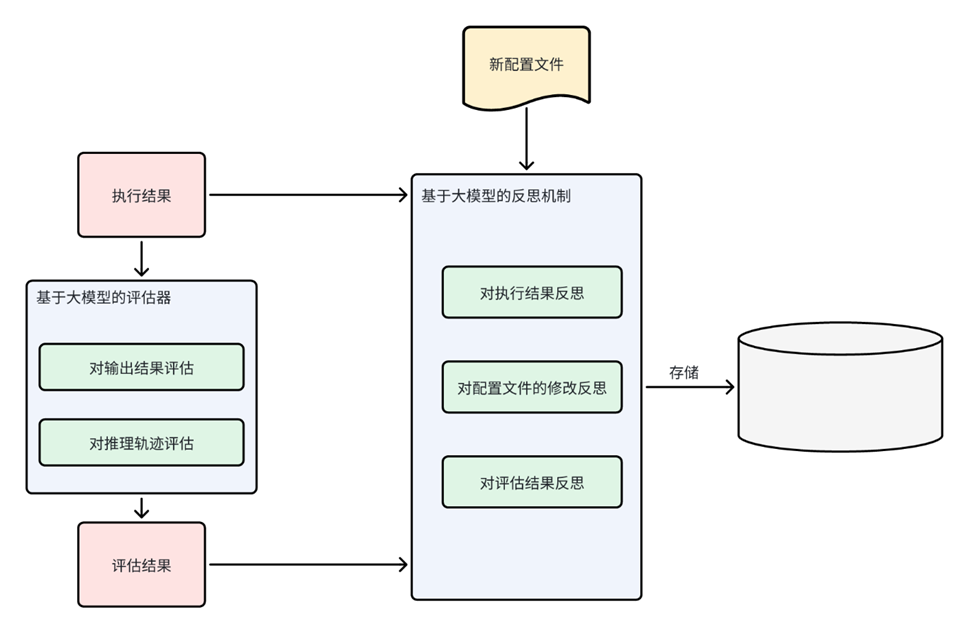

  

## 3.6 智能体的管理

  

在本系统中，智能体自动生成与编排模块负责根据任务描述生成候选智能体，而智能体管理模块负责对这些生成结果进行组织与维护。两者在职责上分离，前者关注如何生成更优智能体，后者关注如何管理已生成智能体并支撑持续使用。结合本系统的实际需求，智能体管理模块的功能边界可明确为两部分：智能体的创建、查看、修改、删除；智能体运行历史的记录与查询。该模块的设计目标是把自动生成的智能体沉淀为可管理、可追踪、可复用的系统资产。

  

智能体管理模块的核心管理对象包括智能体的配置和智能体运行历史。智能体的配置是由自动生成模块输出的图数据库智能体及其编排定义，是系统运行的直接输入对象。智能体的运行历史是用户与智能体的历史交互记录，采用会话组织方式，类似对话系统中的历史页面。一次会话包含用户与智能体的多轮交互记录，主要包括会话标识、轮次顺序、用户输入、智能体回复、工具调用摘要、时间戳以及异常状态等信息。

  

该模块的核心功能包括智能体创建、智能体查看、智能体修改、智能体删除、运行历史管理。智能体创建用于将自动生成模块输出的智能体纳入管理体系。该过程完成对象登记与基础信息初始化，使智能体从生成结果转化为可管理资源。智能体查看用于展示智能体的定义信息与基础状态，便于用户理解其能力边界并选择目标智能体执行任务。该功能是智能体复用的前提。智能体修改用于在既有智能体基础上进行人工调整，以满足特定业务需求或修正个别配置偏差。智能体删除用于清理无效或不再使用的智能体，避免管理对象持续膨胀，降低后续查询和维护成本。运行历史管理用于按智能体维度保存并查询历史执行记录。通过历史记录，用户可以比较不同智能体的运行表现，分析失败模式，并决定是否继续使用、修改或删除对应智能体。