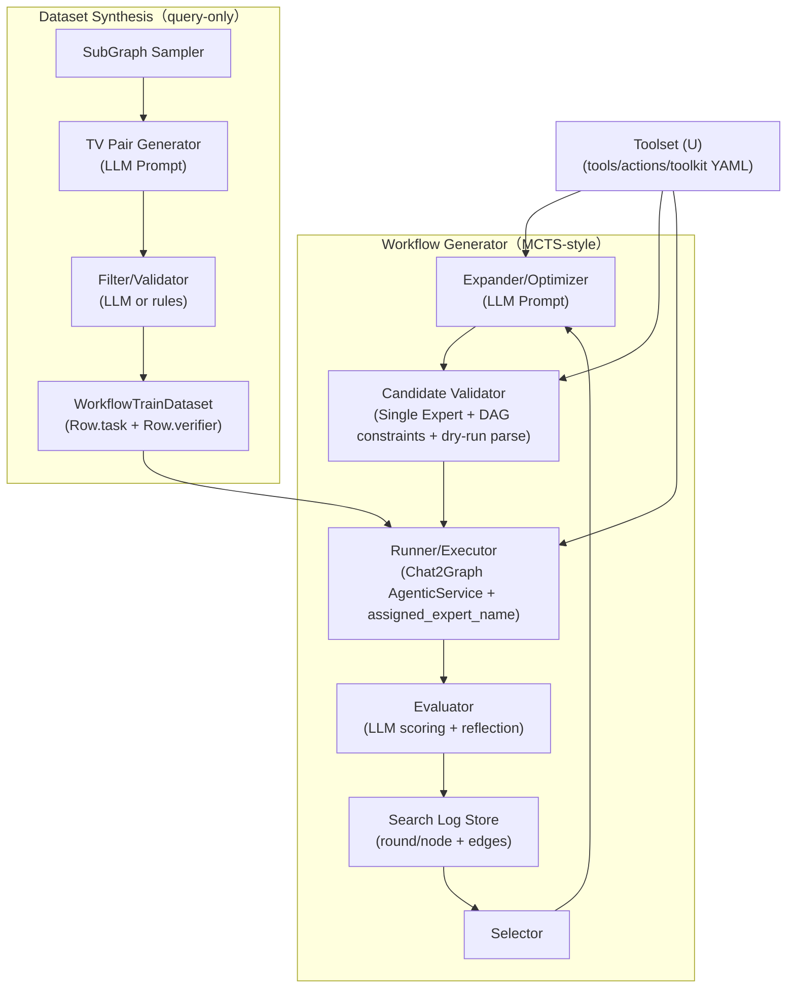

# 重构计划（对齐论文 `extra_doc/new_arch.md`）：Operator=智能体单元，单 Expert=系统入口

本文档已根据我们最新对齐的结论更新：**以 Chat2Graph 现有 SDK/YAML 为“唯一运行时表示”**，把 `Operator` 抽象成论文里的“智能体单元”，把 `Expert` 固定为一个入口容器，仅优化该容器内部的 operators 编排。

本轮重构的目标是“先把生成—执行—评估闭环做得更像论文、也更稳定”，**智能体管理（CRUD/资产中心）先不做**。

---

## 0. 本轮重构的硬约束（结论对齐）

1) **论文里的智能体 A = Chat2Graph 的 Operator（本项目约定）**  
   Operator 具备 `instruction/output_schema/actions`，通过 actions 间接绑定 tools，因此完全可以作为“带工具的智能体单元”来写论文与实现。

2) **固定一个 Expert 作为系统入口（容器）**  
   Expert 只承担“把多个 Operator 编排成可执行流程（DAG/链）”的职责；系统只运行这一个 Expert。  
   我们把它理解为“智能体系统（Agent System）的入口容器”，而不是论文语义里的“单体智能体单元”。

3) **不做 Leader 的多 Expert 任务分解**  
   Chat2Graph 运行时仍会有 `Leader`，但我们通过 `TextMessage.assigned_expert_name` 走 Leader 的“短路分发”分支，直接把任务交给固定 Expert（见 `app/core/agent/leader.py:61`）。

4) **先去掉 non-query**  
   数据合成/评估只做 query（当前实现里 non-query 也不完整且会引入代码不一致）。

5) **单 Expert 模式必须可“自动绑定入口 Expert”**  
   用户对话/评估任务如果未显式设置 `assigned_expert_name`，系统应能在“仅存在一个 expert”时自动补齐，避免无意义的 Leader 分解与额外 LLM 调用。

6) **工具集 U 要从“生成算法”中解耦，并且不依赖 BrowserUse MCP**  
   workflow 搜索时的工具集 U 应作为“外部可切换的配置资产（toolset YAML）”，而不是硬编码在 init template 里；并且我们已确认 `browser-use --mcp` 在当前环境不可用，因此默认 toolset 不能依赖 BrowserUse MCP。

---

## 1. 论文术语 vs 当前实现：名词对齐表（建议直接写进论文/附录）

| 论文变量/术语 | 本项目实现（本次重构约定） | 备注 |
|---|---|---|
| `T` 任务描述 | `WorkflowTrainDataset.task_desc` / `Job.goal` | 生成时主要用 `task_desc`，执行时是 `Row.task` |
| `U` 工具集 | Chat2Graph YAML 的 `tools/actions/toolkit` | Operator 引用 actions，actions 绑定 tools |
| `D` 数据集 | `WorkflowTrainDataset(data=[Row,...])` | `Row.verifier` 用于评估 |
| `G` 图数据库 | `GraphDb` 连接（Neo4j 等） | 数据合成采样 + 运行时工具调用 |
| `A` 智能体 | **Operator** | 论文里“智能体=带工具的单元”，这里用 Operator 对齐 |
| `W` 编排（DAG） | **单 Expert 内部的 Operator DAG** | 在本项目中，DAG 节点=Operator=智能体单元，因此“多智能体 DAG”与“workflow DAG”是同一件事 |
| `E` 评估函数 | `LLMEvaluator`（scoring+reflect） | 产出 `results.json` + reflection |
| Leader 分解 | **不使用** | 仅做路由（assigned_expert_name 短路） |
| 智能体系统入口 | **Expert（固定 1 个）** | 入口容器：持有 workflow，并把 operator DAG 跑起来 |

> 解释：Chat2Graph 源码语义里 `Expert` 更像“Agent”，但为了对齐论文表达，本研究将“可独立执行/可绑定工具/可产生结构化输出的单元”定义为 Operator（智能体单元），Expert 仅作为“智能体系统入口容器”。

---

## 2. 当前实现与论文的主要出入（本轮要修的部分）

### 2.1 执行入口不一致：评估器当前会触发 Leader 分解

`LLMEvaluator` 当前提交任务是 `TextMessage(payload=data.task)`（`app/core/workflow/workflow_generator/mcts_workflow_generator/evaluator.py:141`），未设置 `assigned_expert_name`，因此 Leader 会进入“分解任务→多 expert 协作”的路径。  
这与我们“固定单 Expert 入口，仅优化 operator 编排”的设定冲突。

**修正方向（必须做）**：评估与示例执行时统一设置 `assigned_expert_name=<固定 expert 名>`，让 Leader 走短路分发（`app/core/agent/leader.py:61`）。

### 2.2 non-query 不完整：会导致实现与文档/测试不一致

`SamplingDatasetGenerator` 引用了 `generate_non_query_tv_template`，但 `app/core/prompt/data_synthesis.py` 当前没有该模板；并且 `task_subtypes.py` 的 non-query 子类型映射也是 TODO（`app/core/workflow/dataset_synthesis/task_subtypes.py:354`）。

**修正方向（必须做）**：明确系统 query-only，删掉 non-query/mixed 的代码路径或将其硬降级为 query。

### 2.3 编排 DAG 的运行时约束需要写进“生成器约束”

如果使用 DBGPT workflow 平台，它要求 operator DAG 只有一个 tail（`app/plugin/dbgpt/dbgpt_workflow.py:104`）。  
因此生成器/优化器必须被约束为“单尾 DAG”（最简单：先按链式 SOP 生成）。

### 2.4 “搜索树=版本树”在日志里缺关键字段

目前 `WorkflowLogFormat` 没有 `parent_round` 等字段（`app/core/workflow/workflow_generator/mcts_workflow_generator/model.py:27`），父子关系无法可靠重建。论文 3.5.2 的“树结构可追踪路径”会缺材料。

**修正方向（高优先级）**：日志里补齐 `parent_round`、`child_round`（或单独的 `edges.json`），让 log 可以重建一棵配置版本树。

### 2.5 “论文模块”与“代码模块”边界目前不够清晰

论文 3.5 里的 MCTS 组件（Selector/Optimizer/Executor/Evaluator）在代码里已经有雏形，但目前一些**运行时约束（单 Expert、assigned expert、workflow 平台差异、dry-run 校验）**分散在多个位置，导致：
- 从论文视角回看实现时，模块职责容易混（尤其是“执行器 vs 运行时”）。
- 约束不集中，候选 YAML 很容易在评估阶段才爆炸，浪费轮次与 token。

**修正方向（高优先级）**：把“候选配置不变量”收敛到一个 `validate_candidate_config(...)`（或同等入口）里，并在 expander 产出后、评估前强制校验。

### 2.6 单 Expert 入口缺“可获取/可默认”的能力

在我们采用“单 Expert 入口容器”的设定后，**所有对话/评估都需要绑定到这个 Expert**（否则 Leader 会走分解路径）。当前代码层面存在两个问题：
- 调用方必须手动设置 `TextMessage.assigned_expert_name`，否则会触发 Leader 分解（即使只有一个 expert，也会走一次 LLM 分解提示）。
- 没有一个统一的“entry expert”获取方式（外部系统/脚本不知道应该填哪个 name）。

**修正方向（必须做）**：
1) 提供 `entry_expert_name` 的获取能力（推荐在 `AgenticService` 或 wrapper 层提供）  
2) 在“仅一个 expert”的场景自动补齐默认 `assigned_expert_name`（让使用体验像“单智能体系统”）

### 2.7 工具集 U 的表示与加载方式不够优雅（且 BrowserUse MCP 不可用）

当前 U（tools/actions/toolkit）通常直接写进 init template / 默认 YAML：  
- 造成“搜索算法配置”和“运行时工具资产”耦合在一起，不利于复用/切换（不同实验想用不同工具集）。  
- 每轮 round 的 `workflow.yml` 都会重复携带同一份工具定义，结构上冗余。  
- 我们已确认 `browser-use --mcp` 在当前环境不可用，因此默认 YAML 中引用 BrowserUse MCP 会导致不可控风险（即使不调用，也会增加排查成本）。

**修正方向（高优先级）**：引入“Toolset（U）”作为独立资产（单独 YAML），并在生成器运行时动态装配到候选 workflow 配置里。

---

## 3. 本轮重构范围（做什么 / 不做什么）

**做（优先级从高到低）**
1) query-only 数据合成与评估闭环（去掉 non-query）
2) 固定单 Expert 入口（assigned_expert_name 短路）
3) 约束优化器：只优化 `operators` + 该 Expert 的 `workflow`，并满足 DBGPT 单尾约束
4) 日志可重建“搜索树”（parent/child 关系、改动摘要、分数变化）
5) 增加候选 YAML 的 “dry-run 校验”（至少能被 `AgenticConfig.from_yaml` 解析；必要时再 `AgenticService.load`）

**不做（暂缓）**
- 智能体管理模块（CRUD、资产中心、运行历史检索 UI）
- 论文 IR/Compiler（中间表示）——本轮先以 Chat2Graph SDK YAML 为唯一表示，后续如需要再引入 IR

---

## 4. 推荐的重构/优化方式（结合当前代码架构）

### 4.0 目标架构（重构后“闭环”长什么样）

> 关键点：**Runner 只负责“把候选 YAML 丢给 Chat2Graph 运行并拿到输出”**；Evaluator 决定分数；Validator 负责把“论文约束/工程约束”集中到一个入口。

### Milestone A：query-only（立即修）

**目标**：保证 `dataset_synthesis` 与 doc/测试一致，不再出现 non-query 的死代码或缺失模板。

建议改动点：
- `app/core/workflow/dataset_synthesis/generator.py`：移除对 `generate_non_query_tv_template` 的引用；strategy 固定为 `"query"` 或把 `"mixed"` 也降级为 query。
- `app/core/workflow/dataset_synthesis/task_subtypes.py`：明确只支持 `"query"`（保留 TODO 但不要被运行路径触发）。
- `app/core/prompt/data_synthesis.py`：只保留 query 相关模板。
- 对应单测：`test/unit/workflow_generator/test_dataset_generator.py` 调整 strategy 测试。

### Milestone B：固定单 Expert 入口（论文对齐的关键）

**目标**：执行与评估都只跑一个 Expert，编排只发生在 operators DAG；并且外部调用能“自动绑定入口 Expert”。

建议改动点：
- `app/core/workflow/workflow_generator/mcts_workflow_generator/evaluator.py`：提交任务时设置 `TextMessage(..., assigned_expert_name=MAIN_EXPERT_NAME)`（避免 Leader 分解）。
- `test/example/workflow_generator/workflow_generator_example.py`：同样设置 assigned expert，避免示例行为与论文不一致。
- 在生成器侧新增一个显式参数/配置：`main_expert_name`（默认如 `"Main Expert"`），贯穿 expander/evaluator。
- 新增“入口 Expert 发现/默认绑定”的 SDK 级能力（二选一，推荐两者都做）：
  - `AgenticService.entry_expert_name()`：如果 YAML 只有一个 expert，则返回它的 `profile.name`；否则要求显式指定  
  - `AgenticService.execute/submit` 与 `SessionWrapper.submit`：当 `assigned_expert_name` 为空且仅一个 expert 时，自动补齐（使用户像调用单智能体一样调用）
  - 具体落点文件建议：
    - `app/core/sdk/agentic_service.py`：实现 `entry_expert_name()`；在 `execute/submit` 创建 `Job` 前补齐默认 expert  
    - `app/core/sdk/wrapper/session_wrapper.py`：在 `submit()` 创建 `Job` 前补齐默认 expert（会话对话默认走入口 expert）

### Milestone C：约束 Expander：只生成/维护“一个 Expert + 多个 Operator”

**目标**：避免优化器输出多个 experts，或输出的 workflow 引用不合法。

建议改动点：
- `app/core/prompt/workflow_generator.py`：
  - 在 expert 优化 prompt 中硬约束：只能输出 1 个 expert，且 `profile.name` 必须等于 `main_expert_name`。
  - 强约束：workflow 必须是单尾（或链式）以满足 DBGPT。
- `app/core/workflow/workflow_generator/mcts_workflow_generator/expander.py`：
  - filter 校验增强：expert 数量=1、name 匹配、workflow 引用 operator 全部存在、且满足单尾约束（可通过简单图检查/或 dry-run load）。

### Milestone D：把“搜索树”落到日志（最小版本）

**目标**：不一定要实现复杂的 Tree 类，但 log 至少能重建 parent/child 关系与改动路径，支撑论文 3.5.2 的描述与实验分析。

建议改动点：
- `app/core/workflow/workflow_generator/mcts_workflow_generator/model.py`：
  - `WorkflowLogFormat` 增加 `parent_round: int | None`
- `app/core/workflow/workflow_generator/mcts_workflow_generator/generator.py`：
  - roundN 生成时记录 `parent_round=select_round.round_number`
  - `update_parent_feedbacks` 的 feedback 里补 `child_round`
  - `log_save` 除了 `log.json` 再输出 `edges.json`（可选，便于可视化）

### Milestone E：候选 YAML 校验（减少无效 round）

**目标**：在进入评估前就过滤掉“不可解析/不可执行”的候选配置，减少 token 与时间浪费。

建议策略（从轻到重）：
1) `AgenticConfig.from_yaml` 能 parse（语法 + 结构）
2) 如果仍常失败，再做 `AgenticService.load` dry-run（更重，但能提前发现运行时约束问题）

### Milestone F：代码结构优化（不改变功能，但让“论文模块”更清晰）

这一部分不要求一次性大手术，推荐“小步快跑”的结构收敛（不改变现有对外入口/参数）：

1) 在 `mcts_workflow_generator/` 下增加一个 **单文件的候选校验入口**（例如 `validator.py`）  
   把“单 Expert/固定名称/单尾 DAG/引用合法/parse/dry-run”等约束集中到一处，expander 与 generator 都调用它。

2) 抽一个 `Runner`（或在 evaluator 中拆出 `run_batch(...)`）  
   Runner 只做：`AgenticService.load` → `AgenticService.submit(TextMessage(assigned_expert_name=...))` → 等待输出；不要掺入 scoring 逻辑。  
   说明：评估阶段建议避免走 `SessionWrapper.submit()`，因为它会拼接会话历史 context，增加噪声且影响可复现性。

3) 日志与产物落盘接口化（哪怕仍写文件）  
   先把“写 `workflow_space/...`”封装成 `ArtifactWriter`，以后要迁移到 DB 的 `ArtifactService` 才不会动核心逻辑。

4) 把平台约束显式化成 `WorkflowConstraints`（结构体/配置）  
   例如 `{platform=DBGPT, require_single_tail=True}`，让 expander prompt 与 validator 用同一份约束，避免文档写了但代码没 enforce。

### Milestone G：工具集 U（Toolset）解耦与动态装配

**目标**：把“可用工具集 U”从 init template / 搜索算法中拆出来，成为可切换的独立资产；默认不依赖 BrowserUse MCP。

推荐落地方式（最小可行）：
1) 新增目录：`app/core/sdk/toolsets/`  
   - `graph_only.yml`：仅图数据库相关 LOCAL_TOOL（schema/cypher/analysis/qa 等），**不包含 BrowserUse MCP**  
   - （可选）`full.yml`：包含更多通用工具，但把 MCP 工具拆成可选项/可按环境启用
   - 参考现有工具定义位置（用于抽取/裁剪）：
     - `app/core/workflow/workflow_generator/mcts_workflow_generator/init_template/basic_template.yml`（当前 generator 使用的 tools/actions/toolkit）
     - `app/core/sdk/chat2graph.yml`（更“全量”，但包含 `browser-use --mcp`，默认不要用）
2) 新增一个“配置装配器”（建议放在 workflow generator 侧，而不是侵入 Chat2Graph runtime）：  
   - 输入：`toolset_yml` + `candidate_expert_workflow_yml`（只含 experts/operators/workflow）  
   - 输出：可被 `AgenticConfig.from_yaml` 解析的完整 YAML（供 Runner/Evaluator 执行）
   - 具体落点文件建议：
     - 新增 `app/core/workflow/workflow_generator/mcts_workflow_generator/config_assembler.py`
     - 修改 `app/core/workflow/workflow_generator/mcts_workflow_generator/utils.py` 的 `load_agentic_service(...)`：先装配临时 YAML，再 `AgenticService.load(tmp_path)`
3) Prompt 注入：expander/optimizer 的 prompt 里显式给出 U（action 列表 + tool 简述），并约束“operator.actions 只能从该 action 列表里选”

验收建议：
- 切换 toolset（`graph_only.yml` vs `full.yml`）不影响 MCTS 主逻辑，只影响可用 actions/tools 的上界  
- 默认 toolset 在没有 MCP 环境时可稳定 load & run

### Milestone H：评估隔离（清理单例缓存）与可并发性评估

**目标**：保证每个 round/每个候选配置的评估互不污染；先在单线程稳定复现，后续再考虑并发加速。

#### H.1 “缓存/状态”现在主要存在哪里（需要清理/隔离的点）

1) **Singleton 实例缓存（进程内）**  
   - `Singleton._instances` / `AbcSingleton._instances`：`app/core/common/singleton.py`  
   - 影响：`AgenticService` 及所有 `...Service/Dao`（toolkit、job/message、agent 等）都会跨 round 残留。

2) **工具图（进程内）**  
   - `ToolkitService._toolkit`：`app/core/service/toolkit_service.py`  
   - 影响：多次 `AgenticService.load()` 会不断向工具图 add action/tool，若不重置会导致推荐子图/可用工具集变形。

3) **MCP 连接缓存（进程内）**  
   - `ToolConnectionService._connections`：`app/core/service/tool_connection_service.py`（按 job/operator 缓存连接）  
   - 说明：正常执行路径会在 operator 结束时 `release_connection`（`app/core/workflow/operator.py`），但为了鲁棒性，评估隔离仍应把它视作“需要 reset 的状态”。

4) **环境变量读取缓存（进程内）**  
   - `SystemEnv` 的 `_env_values`：`app/core/common/system_env.py`  
   - 影响：如果评估过程中希望动态切换 env（例如 app_root/db），仅改 os env 可能不会生效（因为值被缓存了）。

5) **SQLite 持久化（磁盘）**  
   - 默认 DB：`~/.chat2graph/system/chat2graph.db`（来自 `SystemEnv.DATABASE_URL` 默认值）  
   - 影响：Job/Message/Session 等会持续写入，虽然不是缓存，但会影响“实验隔离/调试体验/长期增长”。

#### H.2 最小改法（推荐先做）：单线程 + 每轮 reset 单例缓存

- 在 `app/core/workflow/workflow_generator/mcts_workflow_generator/evaluator.py` 的每个 round 开始处调用 `reset_runtime_state()`：  
  - `Singleton._instances.clear()`  
  - `AbcSingleton._instances.clear()`  
  - （可选）清理 `SystemEnv` 的 `_env_values`（可封装成 `SystemEnv.reset_cache()`，避免直接 import 私有变量）
- 然后再做一次 `AgenticService.load(round_workflow.yml)`，并在该 round 内复用 `agent_sys`，不要在 batch 内重复 load。

> 备注：`app/core/dal/database.py` 的 SQLAlchemy `engine` 是模块 import 时创建的，因此“在同一进程里动态切换 DB”并不友好；如果你需要强隔离 DB，建议走多进程或预先设好 env 后再 import。

#### H.3 并发评估的工作量评估（先定预期）

- **同进程并发（不建议）**：需要系统性去单例化（引入 RuntimeContext），工作量大。  
- **多进程并发（可行，中等工作量）**：每个候选/round 在独立进程跑，天然隔离单例；但需要处理：
  - 每进程独立 `APP_ROOT/DATABASE_URL`（避免 SQLite 写锁与数据串扰）
  - 在 import `app.core.dal.database` 前就设置好相关 env（否则 engine 已固定）

---

## 5. 验收标准（本轮）

1) 数据合成与评估链路 query-only，可稳定跑通（不再出现缺模板/缺子类型映射）
2) workflow generator 每轮评估都固定跑同一个 expert（Leader 不分解）
3) expander 输出稳定：一个 expert + 可执行的 operator 编排（满足 DBGPT 单尾约束）
4) 日志可重建 parent/child（能画出“配置版本树”并解释每轮改动）
5) 单 Expert 模式下，用户对话不必手动指定 `assigned_expert_name` 也能稳定命中入口 Expert
6) toolset(U) 可切换，默认不依赖 BrowserUse MCP
7) 评估结果可复现：每轮评估前 runtime 状态被 reset，不会因单例残留导致 round 间污染

---

## 6. 论文表达建议（避免“术语不对齐”被审稿人质疑）

建议在论文里显式写清楚两件事：
1) **研究抽象层**：把 Operator 定义为“智能体单元”，Expert 定义为“系统入口容器”。  
2) **工程落地层**：系统最终被编译/映射为 Chat2Graph SDK YAML 并由其运行时执行；Leader 仅做路由，不参与分解。

---

## 7. FAQ（对应我们讨论过的疑惑，建议留在组内文档）

### 7.1 “搜索树”未显式建模：日志是扁平的，rounds 是什么？

当前实现里，`round` 基本等价于“**一次候选配置（workflow.yml）的版本号**”：  
- `round1` 是 init template  
- `round2..N` 是从某个 parent round 选中后扩展出来的新配置  

但因为 `WorkflowLogFormat` 里没有 `parent_round`，`feedbacks` 里也没 `child_round`，所以**round 之间的父子边是隐式的、不可重建的**。  
论文 3.5.2 的“搜索树”在工程里最小实现就是：log 能还原边（parent→child）+ 节点信息（配置路径/分数/改动摘要/反思）。

### 7.2 为什么要提 `app/core/sdk/agentic_service.py` 和 workflow 平台（builtin/DBGPT）？

因为本系统“生成”的最终产物是 Chat2Graph YAML，需要 **真的跑起来** 才能评估优劣：  
- `AgenticService` 是 Chat2Graph 的运行时入口：负责 load 配置、创建 session、提交消息、执行 workflow  
- workflow 平台（builtin/DBGPT）决定了“DAG 怎么被执行”和一些**硬约束**（例如 DBGPT 单尾 DAG）  

所以在论文的 “Executor/Runner” 落地时，我们无法绕开它：它就是“执行器后端”。

### 7.3 会话/消息/任务持久化现在怎么实现？独立系统能复用吗？

当前 Chat2Graph 运行时有自己的 DAL/DB（默认 SQLite，见 `app/core/common/system_env.py` 的 `DATABASE_URL`），`AgenticService` 初始化时会触发建表（`app/core/dal/init_db.py`）。  
如果你要新开一个独立系统，把 Chat2Graph 当作纯运行时：
- **可以复用**：把它当作运行记录/消息记录的存储（但会耦合 Chat2Graph 的表结构与生命周期）
- **也可以不复用**：你的新系统自己记录实验数据/搜索树/产物，Chat2Graph 只负责执行

推荐思路：生成系统自己维护“搜索树与产物”，Chat2Graph 的 DB 只作为运行时的内部实现细节（可选）。

### 7.4 产物持久化已经有了吗？

有“文件级”的持久化：每轮候选配置写在 `workflow_space/.../round*/workflow.yml`，日志写在 `workflow_space/.../log/log.json`（以及评估输出 `results.json` 等）。  
但目前没有把这些产物统一抽象成“可复用资产”并写入 `ArtifactService`（属于后续管理模块/资产化的一部分）。

### 7.5 “Expert/Operator/DAG”术语怎么对齐？

在本次约定里：
- Operator = 智能体单元（节点）  
- 单 Expert = 智能体系统入口容器（持有 workflow）  
- Workflow DAG = 多智能体 DAG（因为 DAG 的节点就是 Operators）  

因此你说的“编排 DAG 更多体现在 workflow 平台对 operators 的图结构”是对的；而在我们当前对齐下，这个图结构正好就是论文里的“多智能体 DAG”。

### 7.6 “搜索树=log 就行吗？现在到底缺什么？”

“log 可以等价搜索树”成立的前提是：log 能**重建边与路径**。目前缺：
- `parent_round` / `child_round`（边）
- 候选配置的稳定标识（建议加：config hash、或至少 config path）
- 每轮改动摘要与分数变化在数据结构里要规范化（便于写论文实验分析）

把这些补齐后，即使不写 Tree 类，也能用 log 画出树、追踪最优路径与失败分支。

---

## 8. 后续优化方向（不在本轮立即做，但建议尽早排期）

这一节专门记录“看到系统现状后，我们明确还需要做哪些事”，便于下一个 session 直接开工。

### 8.1 数据合成：解决“局部子图≠全局图”导致的不可回答/答案错误

现状：`SamplingDatasetGenerator` 只给 LLM 一段 **采样子图**，但 Row 里的 `verifier`（标准答案）也是 LLM 生成的文本，因此很容易出现：
- 子图里只有 10 个 `A`，全局有 100 个 `A`，但问题问“全局有多少个 A”，答案被 LLM 错写为 10  
- 问题隐含全局枚举（all/list），或隐含全局分布（Top-K、占比、排名）但子图信息不够

建议做的事（路线二选一，推荐走 B）：

**路线 A：明确“问题只关于子图”**（最省事，但更像“离线数据集题目”，不适合线上执行）
- Prompt 里强制要求问题写清楚“在给定子图中…/在本次采样子图中…”
- Filter/Validator 只保留显式子图范围的问题
- 适用：训练早期、快速跑通闭环、对真实性要求不高的 ablation

**路线 B：子图只做“出题锚点”，标准答案必须来自全局图的可执行 verifier**（更贴近真实系统）
- 将 Row 的 `verifier` 从“答案文本”升级为 **可执行验证器**（例如 Cypher / 工具调用计划 / 结构化约束），并由系统执行得到 ground-truth
- 在生成时额外提供/维护 **全局统计摘要**（schema、节点/边计数、关键属性分布的摘要），避免 LLM误判“子图=全局”
- 增加 deterministic 校验：每条样本必须能在 GraphDb 上跑通并返回结果（否则丢弃）

> 重要说明：因为 agent 执行阶段拿到的是**全局图**且不会携带子图上下文，所以如果目标是“线上可执行的图任务”，基本必须采用路线 B（路线 A 只适合作为早期/对照实验）。

落点建议（不改整体接口的最小版本）：
- 新增 `app/core/workflow/dataset_synthesis/validator.py`：`validate_row(row, graph_db, subgraph_ctx)->(ok, reason, normalized_verifier)`  
- 扩展 `Row`（或新增 `RowV2`）字段：`verifier_type`、`cypher`（或 `tool_calls`）、`expected`（JSON）  
- `app/core/workflow/dataset_synthesis/generator.py`：LLM 生成“问题+verifier（cypher）”，本地执行 cypher 得到 expected，再落盘

### 8.2 数据合成：更高难度任务（例如反洗钱资金环/团伙）如何合成

要合成高难度任务，本质上要解决两件事：
1) **采样到“有结构可讲”的子图/模式**（随机游走很难稳定命中“资金环/多层转账/多跳团伙”）  
2) **把难度控制变量显式化**（多跳 + 多条件 + 多阶段分析，而不是纯“写得更玄”）

建议做的事：
- 新增“模式驱动采样器”（Pattern/Motif Sampler），而不是只用 `RandomWalkSampler`：
  - 例如：优先采样含 cycle、hub、双部结构、社区边界、异常高频边的区域（具体 cypher 模式后续再设计）
  - 产出子图时记录 provenance：匹配到的 pattern 类型、seed 节点、pattern 参数
- 新增“场景包”（Scenario Pack）机制：每个业务场景定义
  - graph schema 前提（必须有哪些 label/edge/属性）
  - 任务模板族（例如：找环、找分层、找中介、找团伙核心节点、解释可疑路径）
  - 所需工具（cypher、最短路、社区发现、中心性等）
- 难度分层从“文案级”升级为“结构级”：
  - L2：多跳+多约束的模式匹配（不调用算法）
  - L3：单算法（最短路/社区/中心性）+解释
  - L4：多算法流水线（社区→核心节点→异常）+归因

落点建议：
- `app/core/workflow/dataset_synthesis/sampler.py`：新增 `PatternSampler(SubGraphSampler)`  
- `app/core/workflow/dataset_synthesis/task_subtypes.py`：把“反洗钱/风控”作为可选 scenario 的 subtype 组（按工具能力裁剪）
- `app/core/prompt/data_synthesis.py`：为不同 scenario 提供不同模板（同一 Row schema，但 prompt 注入不同约束）

### 8.3 数据合成：任务分类（taxonomy）需要更标准化/可对齐基准

我们现在的 `task_subtypes.py` 是“自定义分层”，优点是够用，缺点是：
- 很难和外部 benchmark / 论文常见分类直接对齐
- L3/L4 的定义与“系统可用工具能力”之间没有强绑定（容易生成做不到的任务）

建议做的事（这里只列“需要做什么”，不做调研结论）：
- 做一次调研：收集“图数据库/图查询/图分析”的常见任务分类与 benchmark（例如社交网络、金融风控、知识图谱问答等方向的公开基准），整理一份映射表
  - 可先从若干候选方向入手检索（不保证完整/正确，后续调研再确认）：LDBC SNB、金融/风控类 graph benchmark、GraphChallenge、常见 SPARQL/RDF benchmark、以及 Cypher/SQL on graph 的公开题库/测试集等
- 将 taxonomy 拆成两层：
  - **Task Taxonomy（任务类型）**：路径/模式匹配/聚合/算法分析/异常检测…  
  - **Capability Taxonomy（能力/工具上界）**：当前 toolset 能否支持、需要哪些 actions/tools
- 最终产出：
  - `task_subtypes.py` 重构：每个 subtype 显式标注 `required_actions` / `required_tools` / `verifier_type`
  - dataset 生成时按 toolset 自动裁剪 subtype（避免“生成了但跑不了”）

### 8.4 数据质量：从“LLM 过滤”升级为“可验证 + 可量化”

现状：生成与过滤都靠 LLM，存在不可控偏差。

建议做的事：
- 引入“可执行 verifier + 运行结果”作为主质量门槛（路线 B 的一部分）
- 引入一组可量化指标并落盘：
  - 覆盖率：level/subtype 分布、schema 覆盖、edge/type 覆盖
  - 难度指标：hop 数、约束数、是否需要聚合/排序、是否需要算法
  - 去重：语义近重复（基于模板/实体归一化）与结构重复（同一 pattern 反复出现）
- 让 workflow generator 的实验日志能引用 dataset 的这些指标（否则优化结果不可解释）

### 8.5 工程优化：性能/成本/稳定性（以“可重复实验”为目标）

建议做的事：
- 数据合成与评估的缓存与复用：
  - 缓存子图采样结果与全局统计摘要（避免重复查询 DB）
  - 缓存 LLM 生成的中间产物（prompt→raw→parsed→validated）
- 降低噪声：
  - 固定随机种子/采样参数（记录到 metadata）
  - 对每条样本记录完整 provenance（哪次采样、哪轮生成、哪条 verifier）
- 把“数据合成配置”也资产化（类似 toolset）：一个 YAML 定义 sampler/levels/subtypes/validator 开关，便于复现实验

### 8.6 子图采样算法：可改进点与调研计划（工业界 / GitHub / 论文进展）

现状：`app/core/workflow/dataset_synthesis/sampler.py` 当前主要是 `RandomWalkSampler`（带一点 DFS/BFS bias + 去重），优点是实现简单，缺点是：
- **偏置明显**：随机游走容易偏向高 degree 区域，覆盖不到长尾 label/关系类型
- **不面向任务**：采样没有与 task_subtype / 难度目标绑定，导致“难题样本”很难稳定采到结构前提
- **结构不可控**：很难保证包含 cycle/社区边界/多路径等高难度所需 motif；也可能采到信息不足的“碎片”
- **缺评估指标**：当前没有量化“采样质量”的指标，采样改进很难闭环验证

建议做的事（不在本轮实现，先形成调研+实验计划）：

1) 先明确采样目标与指标（写成可复现实验的 checklist）
   - 覆盖：label/edge/type 覆盖率、属性覆盖率、连通性、平均 hop 直径、degree 分布贴合度
   - 多样性：子图相似度去重（结构+属性）、seed 多样性
   - motif 命中率：cycle、hub、bipartite、community bridge、多路径可达 等
   - 任务支持度：能否稳定支撑 L2/L3/L4 的 subtype（尤其 pattern/路径/算法类）
   - 成本：DB 查询次数、每次采样延迟、可并行性

2) 形成候选算法池（调研时分别从“工业界 / GitHub / 论文”收集实现与对比）
   - Random walk 变体：node2vec-style、metropolized random walk、frontier sampling、带重启/teleport 的 walk
   - 扩展式采样：BFS/DFS、snowball、forest fire（适合控制直径/连通性）
   - 分层/约束采样：按 label/关系类型分层抽 seed，再局部扩展；或对特定 label/关系强约束覆盖
   - 社区/结构导向：先用社区发现/中心性粗筛 seed，再采局部（更易命中“团伙/资金环/核心节点”结构）
   - 模式驱动：Pattern/Motif sampler（和 8.2 对齐），用 Cypher 匹配“环/多跳链/中介”种子再扩展
   - 面向 workload：从“目标问题模板”反推采样（先确定要问的结构，再去图里找满足结构的子图）

3) 工业界调研建议（做什么，而不是结论）
   - 看主流图数据库/图分析平台在“随机游走/采样/子图抽取”上的工程实现与约束（性能、分布、可控性）
   - 看 GDS/图嵌入/图学习相关系统里常用的采样（通常有成熟的工程 trick）

4) GitHub 调研建议
   - 目标：找到可复用的“采样算法实现/评估工具”，用于快速原型与对比实验
   - 输出：一张对比表（语言/依赖/可否对接 Neo4j/NetworkX、算法覆盖、license、成熟度、性能）

5) 论文进展调研建议
   - 目标：找到“代表性采样”与“面向 GNN/子图训练”的经典与近期方法，尤其是能量化偏差/覆盖的工作
   - 输出：采样算法分类 + 适用场景 + 与我们系统的映射（random-walk vs pattern-driven vs stratified）

6) 最小落地路径（调研完成后怎么接回工程）
   - 在 `sampler.py` 里增加多 sampler 插件化（`SubGraphSampler` 已有接口，直接扩展即可）
   - 增加 `SamplingReport`（采样指标落盘）并在 dataset metadata 中记录（与 8.5 的“可复现”对齐）
   - 先做 A/B：`RandomWalkSampler` vs `PatternSampler` vs `StratifiedSampler`，用同一套指标与下游样本质量闭环评估
