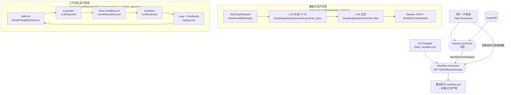
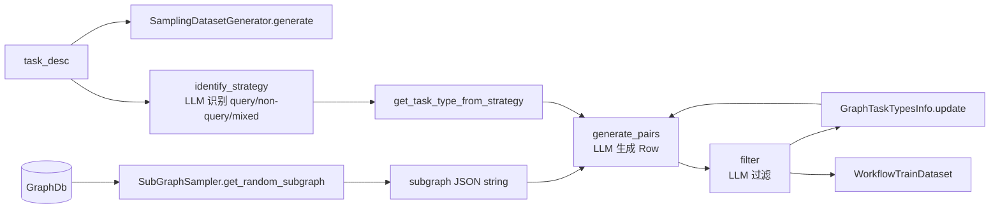
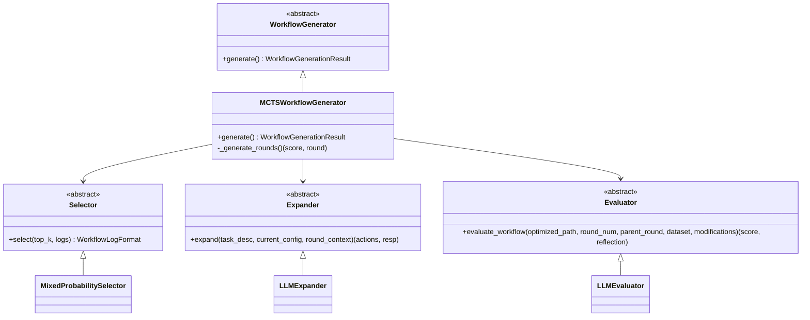
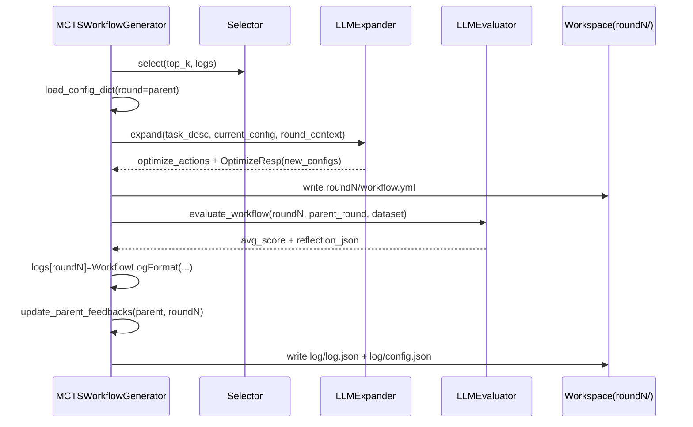
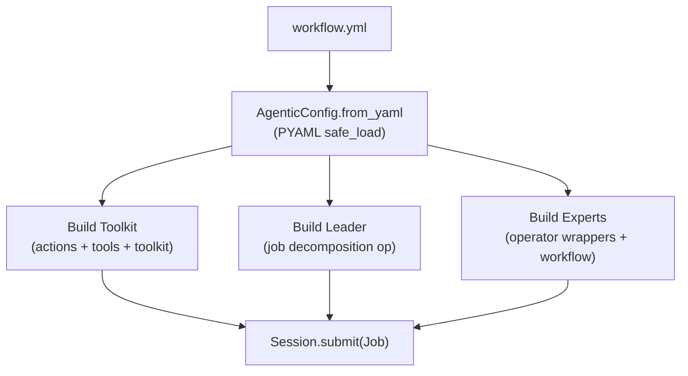

# Workflow 自动生成系统（数据合成 + Workflow Generator）架构说明

本文档基于仓库现有实现，聚焦 `app/core/workflow` 下“数据合成（dataset_synthesis）+ 工作流生成/优化（workflow_generator）”作为一个整体系统，解释它的**整体架构、组件职责、数据/配置流转、产物结构与扩展点**。

## 1. 代码导航（入口在哪里）

**数据合成（Dataset Synthesis）**
- `app/core/workflow/dataset_synthesis/generator.py`：数据集合成主流程（采样 → 生成 → 过滤 → 统计）
- `app/core/workflow/dataset_synthesis/sampler.py`：子图采样接口与默认实现 `RandomWalkSampler`
- `app/core/workflow/dataset_synthesis/model.py`：`Row`、`WorkflowTrainDataset` 等数据结构
- `app/core/workflow/dataset_synthesis/task_subtypes.py`：任务难度/子类型定义 + 统计辅助 `GraphTaskTypesInfo`
- `app/core/workflow/dataset_synthesis/utils.py`：从 JSON 读取训练集
- `app/core/prompt/data_synthesis.py`：合成/过滤相关 Prompt

**工作流生成器（Workflow Generator / MCTS）**
- `app/core/workflow/workflow_generator/generator.py`：抽象接口 `WorkflowGenerator` + 结果结构 `WorkflowGenerationResult`
- `app/core/workflow/workflow_generator/mcts_workflow_generator/generator.py`：`MCTSWorkflowGenerator` 主循环
- `app/core/workflow/workflow_generator/mcts_workflow_generator/selector.py`：选择策略 `MixedProbabilitySelector`
- `app/core/workflow/workflow_generator/mcts_workflow_generator/expander.py`：拓展器 `LLMExpander`（提出优化动作 → 改 operator → 改 expert）
- `app/core/workflow/workflow_generator/mcts_workflow_generator/evaluator.py`：评估器 `LLMEvaluator`（执行工作流 → LLM 打分 → 反思）
- `app/core/workflow/workflow_generator/mcts_workflow_generator/utils.py`：`load_agentic_service`/`load_config_dict`/`format_yaml_with_anchor` 等工具方法
- `app/core/prompt/workflow_generator.py`：MCTS 中 Expander/Evaluator 使用的 Prompt 模板
- `app/core/workflow/workflow_generator/mcts_workflow_generator/init_template/basic_template.yml`：搜索初始 YAML 模板（tools/actions/toolkit 等资源 + 空 operators/experts）

**运行时：YAML 如何变成可执行的多智能体系统**
- `app/core/sdk/agentic_service.py`：`AgenticService.load(yml)` 入口（构建 toolkit、leader、experts、workflow）
- `app/core/model/agentic_config.py`：`AgenticConfig.from_yaml`（解析 YAML 到配置对象）
- `app/core/sdk/wrapper/*`：`OperatorWrapper`、`WorkflowWrapper` 等把配置变成 `Operator`/`Workflow`
- `app/core/workflow/workflow.py`：Builtin workflow 执行语义（DAG + evaluator）
- `app/plugin/dbgpt/dbgpt_workflow.py`：DBGPT workflow 平台的执行语义（要求单 tail）

**示例与测试**
- 示例：`test/example/workflow_generator/workflow_generator_example.py`（端到端：合成数据或加载数据 → MCTS）
- 示例：`test/example/workflow_generator/dataset_generator_example.py`（仅数据合成）
- 单测：`test/unit/workflow_generator/test_dataset_generator.py`、`test/unit/workflow_generator/test_workflow_generator.py`
- 现有文档：`doc/zh-cn/principle/workflow_generator.md`、`doc/zh-cn/principle/workflow.md`、`doc/zh-cn/principle/sdk.md`

---

## 2. 整体架构（端到端）

系统可以被理解为一个**“配置搜索器”**：输入任务描述（以及可选的图数据库），产出一份可执行的 Agentic SDK YAML（`workflow.yml`），让多智能体系统更擅长完成该类任务。



### 关键“流动的东西”（Artifacts / Data）

1) **数据集**：`WorkflowTrainDataset`
- 输入：`task_desc` +（可选）图数据库 + 采样/合成策略
- 输出：`WorkflowTrainDataset(name, task_desc, data=[Row,...])`，通常会被持久化为 JSON 文件

2) **工作流 YAML**：Agentic SDK 配置（`workflow.yml`）
- 初始：`basic_template.yml`（资源齐全，但 `operators: []`、`experts: []` 空）
- 迭代：每一轮生成新的 `roundN/workflow.yml`
- 评估：`LLMEvaluator` 通过 `AgenticService.load(roundN/workflow.yml)` 运行后打分

---

## 3. 核心数据结构（系统的“语言”）

### 3.1 合成数据集：`Row` / `WorkflowTrainDataset`

位于 `app/core/workflow/dataset_synthesis/model.py`：

- `Row`
  - `level`: `L1..L4`（难度）
  - `task_type`: `"query"` / `"non-query"`（当前实现以 query 为主）
  - `task_subtype`: 更细粒度子类型（由 `task_subtypes.py` 定义/统计）
  - `task`: 任务文本（对 query 来说就是 question）
  - `verifier`: 验证/标准答案（对 query 来说就是 answer）

- `WorkflowTrainDataset`
  - `name`: 数据集名称（会参与 MCTS 输出目录命名）
  - `task_desc`: 任务描述（MCTS 的 expander 会用它作为上下文）
  - `data`: `list[Row]`

### 3.2 MCTS 过程数据：Action / Resp / Log / ExecuteResult

位于 `app/core/workflow/workflow_generator/mcts_workflow_generator/model.py`：

- `OptimizeAction`：一条“优化动作建议”（add/modify + target + reason）
- `OptimizeResp`：expander 生成的“配置修改结果”
  - `modifications: list[str]`
  - `new_configs: dict[str, str]`（通常包含 `operators` 与/或 `experts` 两个 section 的 YAML 文本）
- `WorkflowLogFormat`：每轮的记录
  - `score`、`reflection`、`modifications`、`feedbacks`、（可选）`optimize_suggestions`
- `ExecuteResult`：执行某条 dataset row 的结果（含 `ori_score`、`score`、`error`、`succeed`）

---

## 4. 数据合成子系统（dataset_synthesis）详解

### 4.1 组件拆分



对应代码：
- 主类：`SamplingDatasetGenerator`（`app/core/workflow/dataset_synthesis/generator.py`）
- 子图采样：`SubGraphSampler` / `RandomWalkSampler`（`sampler.py`）
- 子类型与统计：`GraphTaskTypesInfo`（`task_subtypes.py`）
- Prompt：`app/core/prompt/data_synthesis.py`

### 4.2 “子图采样”细节：`RandomWalkSampler`

`RandomWalkSampler.get_random_subgraph(...)` 的核心思路：
1. **选择起点**：从图数据库随机挑选一个节点，尽量避免重复（用 `sampled_nodes` 去重；不够时会清空重来）。
2. **多轮随机游走**（最多 `max_depth`）：
   - 对当前 frontier 做邻居扩展
   - 通过 `dfs_bias`（随机落在 0.3~0.7）混合 DFS/BFS 倾向
   - 控制上限：不超过 `max_nodes`、`max_edges`
3. **补齐**：若节点满但边没满，会补边；若边满但节点没满，会补节点。
4. **序列化输出**：输出一个 JSON 字符串：
   - `nodes`: `{elementId, labels, properties}`
   - `relationships`: `{elementId, type, start_node_elementId, end_node_elementId, properties}`

> 这一步的价值：把“全图任务”转化为“局部可验证任务”，降低合成时的幻觉与不可回答问题。

### 4.3 “生成 + 过滤”细节：两个 LLM 调用

`SamplingDatasetGenerator.generate_pairs(...)`：
- 根据 `task_type` 选择 prompt（当前 query 模板存在于 `generate_query_tv_template`）
- 将 `subgraph`、`task_desc`、`task_types_info`（任务定义+统计）注入 prompt
- 得到文本输出后，用 `extract_pairs` 正则抓取 `{...}` JSON 片段并解析为 `Row`

`SamplingDatasetGenerator.filter(...)`：
- 再用一个 prompt 做质量评估，过滤“不可回答/不一致/不相关”的样本
- 输出仍通过 `extract_pairs` 解析为 `Row`

> 注意：`extract_pairs` 的策略是“从文本中抓取所有 `{...}` JSON 对象”，因此 prompt 输出不必严格是 JSON 数组，但对象字段必须完整（`level/task_subtype/task/verifier`）。

---

## 5. 工作流生成子系统（MCTSWorkflowGenerator）详解

### 5.1 组件拆分：Selector / Expander / Evaluator



### 5.2 单轮迭代发生了什么（Round N）



### 5.3 初始化：为什么模板里 operators/experts 是空的

`basic_template.yml` 的定位是“资源底座”：
- 预定义 `tools` / `actions` / `toolkit`（让系统具备执行某类任务所需的工具与动作）
- 但将 `operators: []`、`experts: []` 留空

这样 MCTS 才能把“工作流搜索空间”聚焦在：
- **Operators**：怎么拆分原子能力、怎么写 instruction/output_schema
- **Experts**：怎么编排 operators 成 SOP（workflow）

对应代码：`MCTSWorkflowGenerator.init_workflow()` 会复制模板到 `round1/workflow.yml`，并为“非优化 section”建立 `init_config_dict`（用于后续 round 写回未优化的内容）。

### 5.4 Selector：`MixedProbabilitySelector`

选择逻辑（`selector.py`）：
- 从 logs 中挑 top_k（按 score 排序），强制包含 round1
- 计算“混合分布”采样概率：
  - 一部分是均匀分布（探索）
  - 一部分是 softmax(score)（利用）
- 按概率随机选一个 round 作为 parent

这不是严格的 UCT/PUCT 版本，但实现了“在好结果附近继续探索，同时保留随机探索”的核心思想。

### 5.5 Expander：`LLMExpander`（三段式 LLM 优化）

`LLMExpander.expand(...)` 的 pipeline：
1. `_get_optimize_actions`：根据上下文提出 0~4 条优化动作（`OptimizeAction`）
2. `_expand_operator`：仅针对 operator 相关动作，产出新的 `operators:` YAML section
3. `_expand_experts`：仅针对 expert 相关动作，产出新的 `experts:` YAML section

关键点：
- 上下文 `context` 的组成：`task description/actions/operators/experts/score/modification/reflection/feedbacks`
- `format_yaml_with_anchor(...)` 会把 YAML anchor 名称抽出来，转成 JSON 文本喂给 LLM（因为 PyYAML 解析后拿不到 anchor 名）
- 每次 LLM 输出都会跑 “filter 校验”：
  - `OptimizeAction` / `OptimizeResp` 的 pydantic 校验
  - operators/actions 交叉引用校验（operator 中引用的 action 必须存在）
  - experts/operators 交叉引用校验（expert workflow 中引用的 operator 必须存在）

对应 prompt：`app/core/prompt/workflow_generator.py`

### 5.6 Evaluator：`LLMEvaluator`（执行 + 打分 + 反思）

`LLMEvaluator.evaluate_workflow(...)` 做了三件事：
1. **执行**：对 dataset 的每条 `Row.task`，加载并运行 `roundN/workflow.yml`
   - 通过 `load_agentic_service()` → `AgenticService.load(yml)` 把 YAML 变成可执行系统
   - `agent_sys.session().submit(TextMessage(task))` 提交任务
2. **打分**：用一个 LLM prompt（`eval_prompt_template`）比较 `model_output` vs `verifier` 得到分数（0~3）
3. **反思**：聚合全部 `ExecuteResult` 结果，用 `reflect_prompt_template` 产出 `ReflectResult`（failed_reason/optimize_suggestion）

同时还会落盘：
- `roundN/results.json`：每条样本的 `ExecuteResult`
-（如需）反思结果会进入 round log 的 `reflection` 字段

> 评估里如果 `AgenticService.load` 因 YAML 不合法/执行平台不匹配而失败，会把该 batch 的样本记为 `score=-1` 并记录 error（见 `evaluator.py` 的容错分支）。

---

## 6. YAML 配置与运行时系统（为什么生成的是 workflow.yml）

工作流生成器最终输出的是 Agentic SDK YAML，其被 `AgenticService.load(...)` 消费，构建可运行的多智能体系统：



### 6.1 section 语义（生成器到底在改什么）

以 `basic_template.yml` 为例，常见 section：
- `tools/actions/toolkit`：资源与能力底座（一般不参与优化）
- `operators`：operator 定义（instruction/output_schema/actions）
- `experts`：expert 定义（profile + workflow）
- `plugin.workflow_platform`：选择 workflow 平台（`BUILTIN` / `DBGPT` 等）

`MCTSWorkflowGenerator` 当前主要优化 `operators` 与 `experts` 两段（见 `optimize_grain` 的默认值）。

### 6.2 YAML 引用（anchors/aliases）是“可执行性”的关键

运行时解析（`AgenticConfig._create_from_dict`）对结构有要求：
- operator 的 `actions` 在解析期会提取 action 的 `name`
  - 因此推荐写法是 `- *some_action`（alias 到 actions section 中的 dict）
  - 如果写成纯字符串 `- some_action`，解析期会忽略它（不会进入 action_names 列表）
- expert 的 `workflow` 中应当是 operator dict（通常通过 `- [*some_operator]` alias 引用）
  - 如果写成 operator 名称字符串，`AgenticConfig` 断言会失败

这也是 `LLMExpander` 的 prompt 反复强调“引用必须使用 `*` alias”的原因。

---

## 7. 输出目录结构（你会在磁盘上看到什么）

`MCTSWorkflowGenerator` 会把一次搜索的所有产物落到一个 workspace 下（`optimized_path` + dataset.name + timestamp 后缀）：

```
{optimized_path}/
  {dataset.name}_{time_suffix}/
    round1/
      workflow.yml
      results.json        # evaluator 输出（如果执行了 evaluate_workflow）
    round2/
      workflow.yml
      results.json
    ...
    log/
      log.json            # 每轮 WorkflowLogFormat
      config.json         # max_rounds/top_k/模板路径/最优轮次等
```

---

## 8. 扩展点（如何把它当成“系统”演进）

1) **替换采样策略**：实现 `SubGraphSampler.get_random_subgraph(...)`
2) **自定义数据合成策略**：扩展 `DatasetGenerator`（比如引入规则、模板、弱监督等）
3) **替换选择策略**：实现 `Selector.select(...)`（引入 UCT/PUCT、temperature、分层采样等）
4) **替换拓展策略**：实现 `Expander.expand(...)`（比如加入静态 lint、YAML 结构化生成器等）
5) **替换评估器**：实现 `Evaluator.evaluate_workflow(...)`
   - 例如把 LLM 打分改成更可重复的判分器（执行计划/DB 结果对比/单元测试式断言）

---

## 9. 当前实现的限制 / TODO（建议在系统层面统一处理）

以下条目来自代码现状与测试用例，建议在“整体系统”层面明确约束或补齐：

1) **non-query 任务链路未完整实现**
   - `task_subtypes.py` 里 `SUBTYPES_MAP["non-query"]` 标记为 TODO
   - `app/core/prompt/data_synthesis.py` 当前仅包含 query 相关模板；但 `SamplingDatasetGenerator` 代码中引用了 `generate_non_query_tv_template`（需要补齐/移除以保持一致）
2) **专家 workflow 的 DAG 表达能力有限**
   - YAML 文档与 prompt 将 workflow 描述为 DAG，但当前 `AgenticConfig → AgenticService → WorkflowWrapper` 的组合更接近“一个或多个线性链”
   - `plugin.workflow_platform=DBGPT` 时（模板默认如此），`DbgptWorkflow` 强制要求只有一个 tail operator
3) **LLM 输出校验与运行时解析存在“语义差”**
   - expander 的引用校验主要基于“名称字符串集合”，但运行时解析需要 YAML alias 展开成 dict 才能提取 action/operator 配置
   - 建议把“可被 AgenticService.load 成功解析”作为强校验（比如在 Expander filter 中做一次 dry-run parse）
